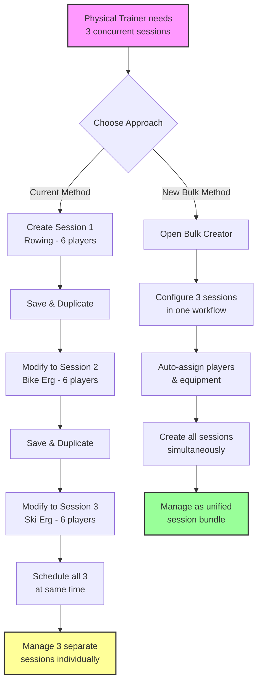
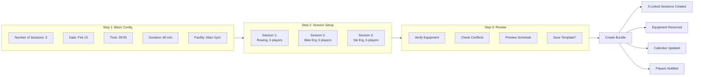
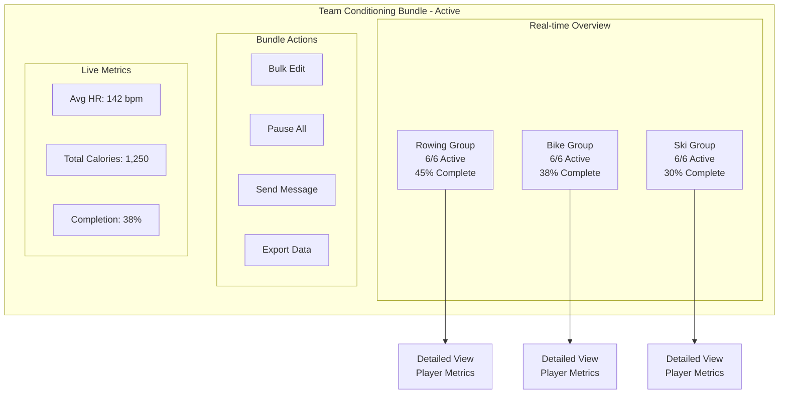
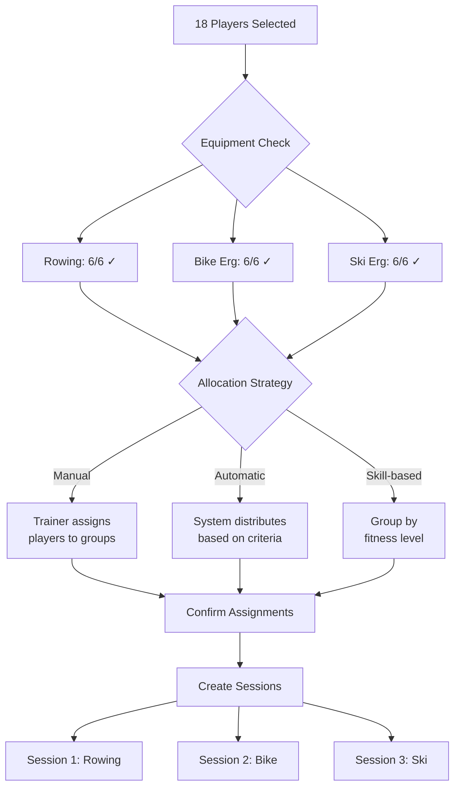
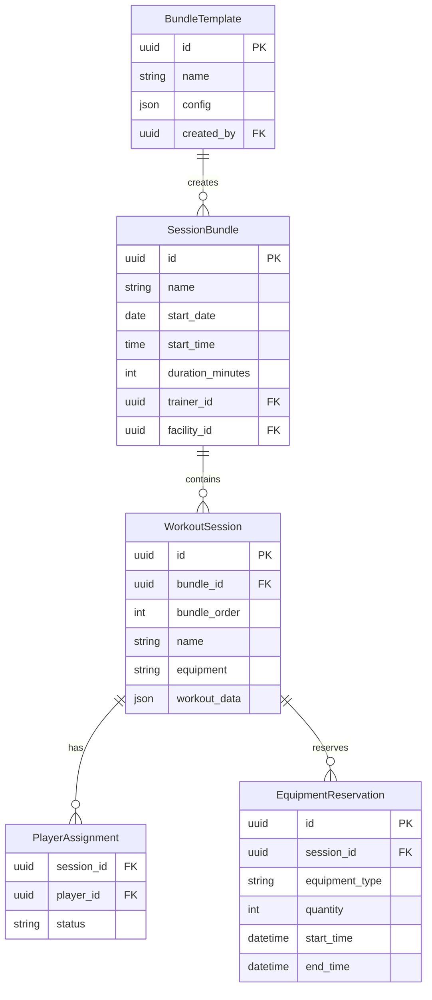
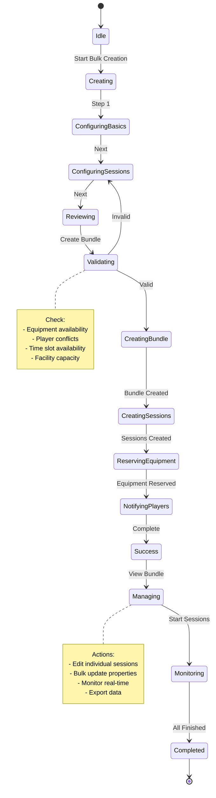
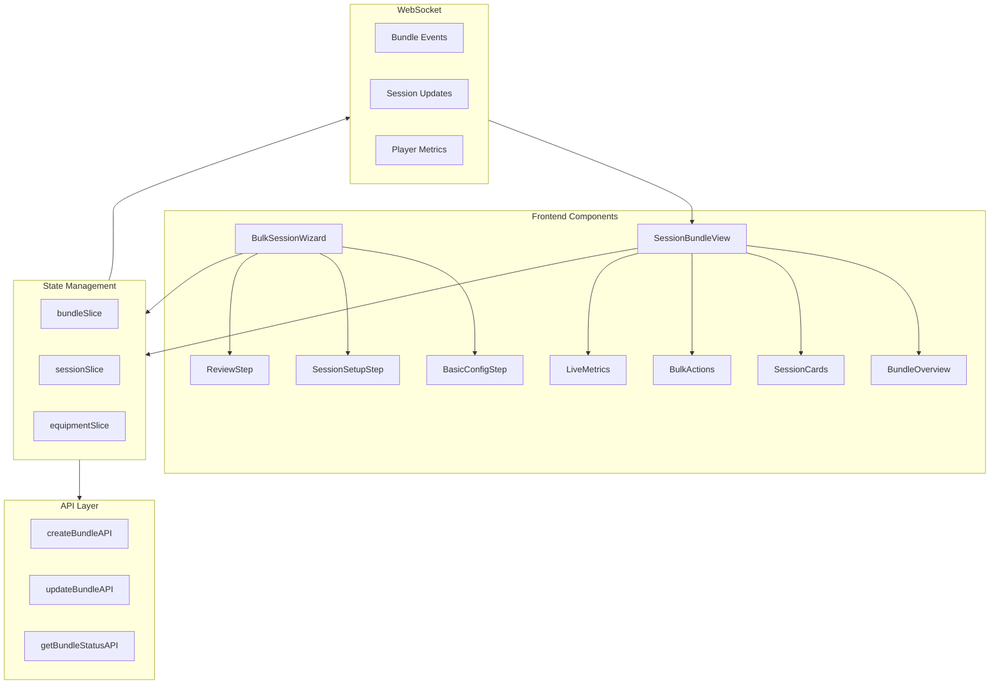

# Bulk Parallel Sessions - User Flow Diagrams

**Status**: Frontend implementation complete (January 2025)  
**Note**: These diagrams reflect the implemented UI flow with temporary inline components for SessionSetupStep

## High-Level User Journey

## Detailed Wizard Flow

## Session Bundle Management View

## Equipment Allocation Logic

## Database Relationships

## State Management Flow

## Component Architecture

---

These diagrams illustrate:
1. **User Journey**: Comparing current vs. new workflow
2. **Wizard Flow**: Step-by-step creation process
3. **Management View**: How bundles are monitored
4. **Equipment Logic**: Allocation decision tree
5. **Database Design**: Entity relationships
6. **State Flow**: Application state transitions
7. **Architecture**: Component organization

The visual flows complement the implementation plan and can be used for:
- Stakeholder presentations
- Developer reference
- UI/UX design discussions
- Documentation