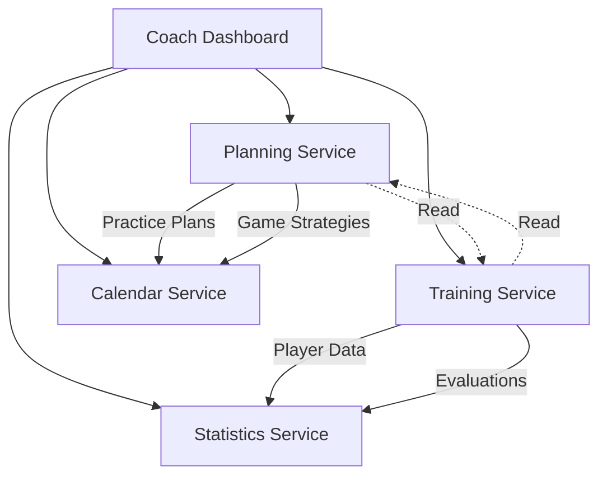

# Coach Dashboard Data Architecture

**Last Updated**: January 2025  
**Purpose**: Define entities and APIs for coach-created data across Planning and Training services

## Overview

The Coach Dashboard creates extensive player and team data that will be distributed across existing services:
- **Planning Service**: Team-level tactical and strategic data
- **Training Service**: Individual player development and evaluation data
- **Statistics Service**: Read-only aggregated views and analytics

---

## 📊 Planning Service Extensions

### New Entities for Tactical/Strategic Features

#### 1. TacticalPlan Entity
```typescript
// services/planning-service/src/entities/TacticalPlan.ts
import { Entity, PrimaryGeneratedColumn, Column, ManyToOne, OneToMany, CreateDateColumn, UpdateDateColumn } from 'typeorm';

@Entity('tactical_plans')
export class TacticalPlan {
  @PrimaryGeneratedColumn('uuid')
  id: string;

  @Column()
  coachId: string;

  @Column()
  teamId: string;

  @Column()
  name: string; // "Aggressive Forecheck", "Neutral Zone Trap"

  @Column('enum', { 
    enum: ['offensive', 'defensive', 'transition', 'special_teams'] 
  })
  category: string;

  @Column('jsonb')
  formation: {
    type: 'even_strength' | 'powerplay' | 'penalty_kill' | '6_on_5' | '5_on_3';
    zones: {
      offensive: PlayerPosition[];
      neutral: PlayerPosition[];
      defensive: PlayerPosition[];
    };
  };

  @Column('jsonb')
  playerAssignments: {
    playerId: string;
    position: string;
    responsibilities: string[];
    alternatePosition?: string;
  }[];

  @Column('text', { nullable: true })
  description: string;

  @Column('jsonb', { nullable: true })
  triggers: {
    situation: string; // "After opponent dumps puck"
    action: string;    // "D1 retrieves, passes to W1"
  }[];

  @Column('jsonb', { nullable: true })
  videoReferences: {
    url: string;
    timestamp: number;
    description: string;
  }[];

  @Column({ default: true })
  isActive: boolean;

  @CreateDateColumn()
  createdAt: Date;

  @UpdateDateColumn()
  updatedAt: Date;

  @OneToMany(() => PlaybookPlay, play => play.tacticalPlan)
  plays: PlaybookPlay[];
}

interface PlayerPosition {
  playerId?: string;
  position: 'C' | 'LW' | 'RW' | 'LD' | 'RD' | 'G';
  x: number; // Ice position coordinates
  y: number;
  zone: 'offensive' | 'neutral' | 'defensive';
}
```

#### 2. PlaybookPlay Entity
```typescript
// services/planning-service/src/entities/PlaybookPlay.ts
@Entity('playbook_plays')
export class PlaybookPlay {
  @PrimaryGeneratedColumn('uuid')
  id: string;

  @ManyToOne(() => TacticalPlan, plan => plan.plays)
  tacticalPlan: TacticalPlan;

  @Column()
  name: string; // "Breakout Option 1", "Cycle Play A"

  @Column('enum', {
    enum: ['breakout', 'forecheck', 'cycle', 'rush', 'faceoff', 'powerplay', 'penalty_kill']
  })
  type: string;

  @Column('jsonb')
  sequence: PlaySequenceStep[];

  @Column('jsonb', { nullable: true })
  contingencies: {
    condition: string;
    alternativeAction: string;
  }[];

  @Column('text', { nullable: true })
  coachingPoints: string;

  @Column('jsonb', { nullable: true })
  practiceNotes: {
    date: Date;
    success_rate: number;
    notes: string;
  }[];

  @Column({ default: 0 })
  usageCount: number; // Track in games

  @Column({ default: 0 })
  successRate: number; // Percentage
}

interface PlaySequenceStep {
  stepNumber: number;
  playerId?: string;
  position?: string;
  action: 'pass' | 'carry' | 'shoot' | 'screen' | 'retrieve' | 'support';
  from: { x: number; y: number };
  to: { x: number; y: number };
  timing?: number; // seconds
  description: string;
}
```

#### 3. PracticePlan Entity
```typescript
// services/planning-service/src/entities/PracticePlan.ts
@Entity('practice_plans')
export class PracticePlan {
  @PrimaryGeneratedColumn('uuid')
  id: string;

  @Column()
  coachId: string;

  @Column()
  teamId: string;

  @Column('date')
  date: Date;

  @Column('time')
  startTime: string;

  @Column()
  duration: number; // minutes

  @Column()
  facilityId: string;

  @Column('enum', {
    enum: ['on_ice', 'off_ice', 'video', 'classroom']
  })
  type: string;

  @Column('jsonb')
  segments: PracticeSegment[];

  @Column('jsonb')
  equipmentNeeded: string[];

  @Column('jsonb', { nullable: true })
  assistantCoachAssignments: {
    coachId: string;
    responsibility: string;
  }[];

  @Column('text', { nullable: true })
  objectives: string;

  @Column('text', { nullable: true })
  postPracticeNotes: string;

  @Column('jsonb', { nullable: true })
  playerAttendance: {
    playerId: string;
    status: 'present' | 'absent' | 'injured' | 'late';
    notes?: string;
  }[];

  @CreateDateColumn()
  createdAt: Date;
}

interface PracticeSegment {
  name: string; // "Warm-up", "Power Play Work"
  duration: number; // minutes
  drills: {
    drillId: string;
    name: string;
    duration: number;
    groups?: string[][]; // Player IDs in groups
    focus: string[]; // ["passing", "timing"]
    equipment: string[];
    notes?: string;
  }[];
  waterBreak?: boolean;
}
```

#### 4. GameStrategy Entity
```typescript
// services/planning-service/src/entities/GameStrategy.ts
@Entity('game_strategies')
export class GameStrategy {
  @PrimaryGeneratedColumn('uuid')
  id: string;

  @Column()
  coachId: string;

  @Column()
  teamId: string;

  @Column()
  gameId: string; // Reference to calendar event

  @Column()
  opponentTeamId: string;

  @Column('jsonb')
  lineups: {
    even_strength: LineCombo[];
    powerplay: LineCombo[];
    penalty_kill: LineCombo[];
    overtime?: LineCombo[];
    extra_attacker?: LineCombo[];
  };

  @Column('jsonb')
  matchups: {
    ourLine: string; // Line name/number
    opposingLine: string;
    strategy: string;
  }[];

  @Column('jsonb')
  specialInstructions: {
    playerId: string;
    instructions: string[];
  }[];

  @Column('jsonb')
  opponentScouting: {
    strengths: string[];
    weaknesses: string[];
    keyPlayers: {
      playerId: string;
      name: string;
      tendencies: string[];
      howToDefend: string;
    }[];
    goalieTendencies?: {
      gloveHigh: number; // percentage
      gloveLow: number;
      blockerHigh: number;
      blockerLow: number;
      fiveHole: number;
      wraparound: number;
    };
  };

  @Column('text', { nullable: true })
  preGameSpeech: string;

  @Column('jsonb', { nullable: true })
  periodAdjustments: {
    period: 1 | 2 | 3 | 'OT';
    adjustments: string[];
    lineChanges?: any;
  }[];

  @Column('jsonb', { nullable: true })
  postGameAnalysis: {
    goalsFor: GoalAnalysis[];
    goalsAgainst: GoalAnalysis[];
    whatWorked: string[];
    whatDidntWork: string[];
    playerPerformance: {
      playerId: string;
      rating: number;
      notes: string;
    }[];
  };

  @CreateDateColumn()
  createdAt: Date;

  @UpdateDateColumn()
  updatedAt: Date;
}

interface LineCombo {
  name: string; // "First Line", "PP1"
  forwards: string[]; // Player IDs
  defense: string[]; // Player IDs
  goalie?: string;
  chemistry: number; // 0-100
  minutesPlayed?: number;
  plusMinus?: number;
}

interface GoalAnalysis {
  time: string;
  period: number;
  scoredBy: string;
  assists: string[];
  situation: string;
  description: string;
  preventable: boolean;
  notes?: string;
}
```

#### 5. DrillLibrary Entity
```typescript
// services/planning-service/src/entities/DrillLibrary.ts
@Entity('drill_library')
export class DrillLibrary {
  @PrimaryGeneratedColumn('uuid')
  id: string;

  @Column()
  name: string;

  @Column()
  createdBy: string; // Coach ID

  @Column('enum', {
    enum: ['skating', 'passing', 'shooting', 'checking', 'positioning', 
           'conditioning', 'goalie', 'team_systems', 'small_games']
  })
  category: string;

  @Column('simple-array')
  skillFocus: string[]; // ["acceleration", "edge work", "crossovers"]

  @Column('enum', {
    enum: ['beginner', 'intermediate', 'advanced', 'elite']
  })
  difficulty: string;

  @Column()
  minPlayers: number;

  @Column()
  maxPlayers: number;

  @Column()
  duration: number; // minutes

  @Column('simple-array')
  requiredEquipment: string[];

  @Column('jsonb')
  setup: {
    rinkDivision: 'full' | 'half' | 'third' | 'corner' | 'neutral_zone';
    cones: { x: number; y: number; color: string }[];
    pucks: { x: number; y: number }[];
    otherMarkers: any[];
  };

  @Column('text')
  description: string;

  @Column('jsonb')
  progressions: {
    level: number;
    modification: string;
    addedDifficulty: string;
  }[];

  @Column('simple-array', { nullable: true })
  coachingPoints: string[];

  @Column('jsonb', { nullable: true })
  commonMistakes: {
    mistake: string;
    correction: string;
  }[];

  @Column({ nullable: true })
  videoUrl: string;

  @Column({ nullable: true })
  diagramUrl: string;

  @Column({ default: true })
  isPublic: boolean;

  @Column({ default: 0 })
  usageCount: number;

  @Column({ default: 0 })
  rating: number;

  @CreateDateColumn()
  createdAt: Date;
}
```

---

## 🏋️ Training Service Extensions

### New Entities for Player Development Features

#### 1. PlayerEvaluation Entity
```typescript
// services/training-service/src/entities/PlayerEvaluation.ts
@Entity('player_evaluations')
export class PlayerEvaluation {
  @PrimaryGeneratedColumn('uuid')
  id: string;

  @Column()
  playerId: string;

  @Column()
  coachId: string;

  @Column()
  teamId: string;

  @Column('date')
  evaluationDate: Date;

  @Column('enum', {
    enum: ['preseason', 'midseason', 'postseason', 'monthly', 'game', 'practice']
  })
  type: string;

  @Column('jsonb')
  technicalSkills: {
    skating: {
      forward: number; // 1-10
      backward: number;
      acceleration: number;
      agility: number;
      speed: number;
      balance: number;
      edgeWork: number;
    };
    puckHandling: {
      carrying: number;
      protection: number;
      deking: number;
      receiving: number;
      inTraffic: number;
    };
    shooting: {
      wristShot: number;
      slapShot: number;
      snapshot: number;
      backhand: number;
      accuracy: number;
      release: number;
      power: number;
    };
    passing: {
      forehand: number;
      backhand: number;
      saucer: number;
      accuracy: number;
      timing: number;
      vision: number;
    };
  };

  @Column('jsonb')
  tacticalSkills: {
    offensive: {
      positioning: number;
      spacing: number;
      timing: number;
      creativity: number;
      finishing: number;
    };
    defensive: {
      positioning: number;
      gapControl: number;
      stickPosition: number;
      bodyPosition: number;
      anticipation: number;
    };
    transition: {
      breakouts: number;
      rushes: number;
      tracking: number;
      backchecking: number;
    };
  };

  @Column('jsonb')
  physicalAttributes: {
    strength: number;
    speed: number;
    endurance: number;
    flexibility: number;
    balance: number;
    coordination: number;
  };

  @Column('jsonb')
  mentalAttributes: {
    hockeyIQ: number;
    competitiveness: number;
    workEthic: number;
    coachability: number;
    leadership: number;
    teamwork: number;
    discipline: number;
    confidence: number;
    focusUnderPressure: number;
  };

  @Column('text', { nullable: true })
  strengths: string;

  @Column('text', { nullable: true })
  areasForImprovement: string;

  @Column('text', { nullable: true })
  coachComments: string;

  @Column('jsonb', { nullable: true })
  gameSpecificNotes: {
    gamesObserved: number;
    goals: number;
    assists: number;
    plusMinus: number;
    penaltyMinutes: number;
    keyMoments: string[];
  };

  @Column('jsonb')
  developmentPriorities: {
    priority: number;
    skill: string;
    targetImprovement: string;
    timeline: string;
  }[];

  @Column({ nullable: true })
  overallRating: number; // 1-100

  @Column({ nullable: true })
  potential: string; // "Elite", "High", "Average", "Depth"

  @CreateDateColumn()
  createdAt: Date;

  @UpdateDateColumn()
  updatedAt: Date;
}
```

#### 2. PlayerDevelopmentPlan Entity
```typescript
// services/training-service/src/entities/PlayerDevelopmentPlan.ts
@Entity('player_development_plans')
export class PlayerDevelopmentPlan {
  @PrimaryGeneratedColumn('uuid')
  id: string;

  @Column()
  playerId: string;

  @Column()
  coachId: string;

  @Column()
  seasonId: string;

  @Column('date')
  startDate: Date;

  @Column('date')
  endDate: Date;

  @Column('jsonb')
  currentLevel: {
    overallRating: number;
    strengths: string[];
    weaknesses: string[];
    recentEvaluation: string; // Evaluation ID
  };

  @Column('jsonb')
  goals: DevelopmentGoal[];

  @Column('jsonb')
  weeklyPlan: {
    week: number;
    focus: string[];
    drills: string[]; // Drill IDs
    targetMetrics: any;
    actualMetrics?: any;
  }[];

  @Column('jsonb')
  milestones: {
    date: Date;
    description: string;
    metric: string;
    target: number;
    achieved?: number;
    status: 'pending' | 'achieved' | 'missed';
  }[];

  @Column('jsonb', { nullable: true })
  parentCommunication: {
    date: Date;
    method: 'meeting' | 'email' | 'phone';
    summary: string;
    nextFollowUp?: Date;
  }[];

  @Column('jsonb', { nullable: true })
  externalResources: {
    type: 'video' | 'article' | 'course' | 'camp';
    name: string;
    url?: string;
    assignedDate: Date;
    completedDate?: Date;
  }[];

  @Column('enum', {
    enum: ['active', 'paused', 'completed', 'archived']
  })
  status: string;

  @Column('text', { nullable: true })
  notes: string;

  @CreateDateColumn()
  createdAt: Date;

  @UpdateDateColumn()
  updatedAt: Date;
}

interface DevelopmentGoal {
  id: string;
  category: 'technical' | 'tactical' | 'physical' | 'mental';
  skill: string;
  currentLevel: number;
  targetLevel: number;
  deadline: Date;
  specificActions: string[];
  measurementMethod: string;
  progress: number; // percentage
  status: 'not_started' | 'in_progress' | 'completed' | 'delayed';
}
```

#### 3. VideoAnalysis Entity
```typescript
// services/training-service/src/entities/VideoAnalysis.ts
@Entity('video_analyses')
export class VideoAnalysis {
  @PrimaryGeneratedColumn('uuid')
  id: string;

  @Column()
  coachId: string;

  @Column()
  playerId: string;

  @Column({ nullable: true })
  teamId: string;

  @Column({ nullable: true })
  gameId: string;

  @Column()
  videoUrl: string;

  @Column()
  title: string;

  @Column('enum', {
    enum: ['game', 'practice', 'skills', 'tactical']
  })
  type: string;

  @Column('jsonb')
  clips: VideoClip[];

  @Column('jsonb', { nullable: true })
  playerPerformance: {
    positives: AnalysisPoint[];
    improvements: AnalysisPoint[];
    keyMoments: AnalysisPoint[];
  };

  @Column('jsonb', { nullable: true })
  teamAnalysis: {
    systemExecution: AnalysisPoint[];
    breakdowns: AnalysisPoint[];
    opportunities: AnalysisPoint[];
  };

  @Column('text', { nullable: true })
  summary: string;

  @Column('simple-array', { nullable: true })
  tags: string[];

  @Column({ default: false })
  sharedWithPlayer: boolean;

  @Column({ default: false })
  sharedWithTeam: boolean;

  @CreateDateColumn()
  createdAt: Date;
}

interface VideoClip {
  startTime: number; // seconds
  endTime: number;
  title: string;
  category: 'positive' | 'negative' | 'neutral' | 'teaching';
  players: string[]; // Player IDs involved
  description: string;
  coachingPoints: string[];
  drawingData?: any; // Telestrator/drawing overlay data
}

interface AnalysisPoint {
  timestamp: number;
  description: string;
  category: string;
  importance: 'high' | 'medium' | 'low';
}
```

#### 4. SkillProgressionTracking Entity
```typescript
// services/training-service/src/entities/SkillProgressionTracking.ts
@Entity('skill_progression_tracking')
export class SkillProgressionTracking {
  @PrimaryGeneratedColumn('uuid')
  id: string;

  @Column()
  playerId: string;

  @Column()
  coachId: string;

  @Column()
  skill: string; // "Wrist Shot", "Backward Crossovers"

  @Column()
  category: string; // "Shooting", "Skating"

  @Column('jsonb')
  measurements: SkillMeasurement[];

  @Column('jsonb', { nullable: true })
  benchmarks: {
    ageGroup: string;
    elite: number;
    above_average: number;
    average: number;
    below_average: number;
  };

  @Column('jsonb', { nullable: true })
  drillHistory: {
    date: Date;
    drillId: string;
    drillName: string;
    performance: number;
    notes?: string;
  }[];

  @Column({ nullable: true })
  currentLevel: number;

  @Column({ nullable: true })
  targetLevel: number;

  @Column({ nullable: true })
  improvementRate: number; // percentage per month

  @CreateDateColumn()
  startDate: Date;

  @UpdateDateColumn()
  lastUpdated: Date;
}

interface SkillMeasurement {
  date: Date;
  value: number;
  unit: string; // "km/h", "accuracy %", "reps"
  testConditions?: string;
  evaluatorId: string;
  notes?: string;
  videoReference?: string;
}
```

#### 5. PlayerFeedback Entity
```typescript
// services/training-service/src/entities/PlayerFeedback.ts
@Entity('player_feedback')
export class PlayerFeedback {
  @PrimaryGeneratedColumn('uuid')
  id: string;

  @Column()
  playerId: string;

  @Column()
  coachId: string;

  @Column('enum', {
    enum: ['game', 'practice', 'general', 'behavioral', 'tactical']
  })
  type: string;

  @Column({ nullable: true })
  relatedEventId: string; // Game or Practice ID

  @Column('enum', {
    enum: ['positive', 'constructive', 'critical', 'mixed']
  })
  tone: string;

  @Column('text')
  message: string;

  @Column('simple-array', { nullable: true })
  actionItems: string[];

  @Column({ default: false })
  requiresResponse: boolean;

  @Column({ nullable: true })
  playerResponse: string;

  @Column({ nullable: true })
  playerResponseDate: Date;

  @Column({ default: false })
  parentVisible: boolean;

  @Column('enum', {
    enum: ['unread', 'read', 'acknowledged', 'discussed']
  })
  status: string;

  @Column({ nullable: true })
  discussedInPerson: Date;

  @CreateDateColumn()
  createdAt: Date;
}
```

---

## 🔌 API Endpoints

### Planning Service API Extensions

#### Tactical Plans
```typescript
// Tactical Plan Management
POST   /api/planning/tactical-plans
GET    /api/planning/tactical-plans?teamId={teamId}
GET    /api/planning/tactical-plans/{id}
PUT    /api/planning/tactical-plans/{id}
DELETE /api/planning/tactical-plans/{id}
POST   /api/planning/tactical-plans/{id}/duplicate

// Playbook Management
POST   /api/planning/tactical-plans/{planId}/plays
GET    /api/planning/tactical-plans/{planId}/plays
PUT    /api/planning/plays/{playId}
DELETE /api/planning/plays/{playId}
POST   /api/planning/plays/{playId}/track-usage

// Practice Plans
POST   /api/planning/practice-plans
GET    /api/planning/practice-plans?teamId={teamId}&date={date}
GET    /api/planning/practice-plans/{id}
PUT    /api/planning/practice-plans/{id}
DELETE /api/planning/practice-plans/{id}
POST   /api/planning/practice-plans/{id}/attendance
POST   /api/planning/practice-plans/{id}/notes
GET    /api/planning/practice-plans/calendar?teamId={teamId}&month={month}

// Game Strategy
POST   /api/planning/game-strategies
GET    /api/planning/game-strategies/{gameId}
PUT    /api/planning/game-strategies/{id}
POST   /api/planning/game-strategies/{id}/lineups
POST   /api/planning/game-strategies/{id}/adjustments
POST   /api/planning/game-strategies/{id}/post-game-analysis
GET    /api/planning/game-strategies/upcoming?teamId={teamId}

// Drill Library
POST   /api/planning/drills
GET    /api/planning/drills?category={category}&difficulty={difficulty}
GET    /api/planning/drills/{id}
PUT    /api/planning/drills/{id}
DELETE /api/planning/drills/{id}
POST   /api/planning/drills/{id}/rate
GET    /api/planning/drills/search?q={query}
GET    /api/planning/drills/favorites?coachId={coachId}
```

### Training Service API Extensions

#### Player Development
```typescript
// Player Evaluations
POST   /api/training/evaluations
GET    /api/training/evaluations/player/{playerId}
GET    /api/training/evaluations/{id}
PUT    /api/training/evaluations/{id}
DELETE /api/training/evaluations/{id}
GET    /api/training/evaluations/team/{teamId}/latest
POST   /api/training/evaluations/bulk-create
GET    /api/training/evaluations/compare?playerIds={ids}&dateRange={range}

// Development Plans
POST   /api/training/development-plans
GET    /api/training/development-plans/player/{playerId}
GET    /api/training/development-plans/{id}
PUT    /api/training/development-plans/{id}
PUT    /api/training/development-plans/{id}/status
POST   /api/training/development-plans/{id}/goals
PUT    /api/training/development-plans/{id}/goals/{goalId}
POST   /api/training/development-plans/{id}/milestones
GET    /api/training/development-plans/team/{teamId}

// Video Analysis
POST   /api/training/video-analysis
GET    /api/training/video-analysis?playerId={playerId}
GET    /api/training/video-analysis/{id}
PUT    /api/training/video-analysis/{id}
DELETE /api/training/video-analysis/{id}
POST   /api/training/video-analysis/{id}/clips
PUT    /api/training/video-analysis/{id}/share
GET    /api/training/video-analysis/game/{gameId}

// Skill Progression
POST   /api/training/skill-progression
GET    /api/training/skill-progression/player/{playerId}
GET    /api/training/skill-progression/{id}
POST   /api/training/skill-progression/{id}/measurements
GET    /api/training/skill-progression/team/{teamId}/summary
GET    /api/training/skill-progression/reports?teamId={teamId}&skill={skill}

// Player Feedback
POST   /api/training/feedback
GET    /api/training/feedback/player/{playerId}
GET    /api/training/feedback/{id}
PUT    /api/training/feedback/{id}
DELETE /api/training/feedback/{id}
POST   /api/training/feedback/{id}/player-response
PUT    /api/training/feedback/{id}/status
GET    /api/training/feedback/pending-responses?coachId={coachId}
```

---

## 🔄 Data Flow & Integration

### Service Communication Flow



### Cross-Service Data Access Patterns

#### 1. Creating a Practice Plan with Player Assignments
```typescript
// Coach Dashboard creates practice plan
const practicePlan = await planningService.createPracticePlan({
  date: '2025-01-20',
  segments: [...],
  // Players retrieved from User Service
});

// Calendar Service notified
await eventBus.emit('practice.scheduled', {
  planId: practicePlan.id,
  teamId: practicePlan.teamId,
  date: practicePlan.date
});

// Training Service tracks attendance
await trainingService.linkPracticeToTraining(practicePlan.id);
```

#### 2. Game Strategy with Player Evaluations
```typescript
// Coach creates game strategy
const strategy = await planningService.createGameStrategy({
  gameId: 'calendar-event-123',
  lineups: {...},
  // Player performance data from Training Service
});

// After game, update evaluations
await trainingService.createGameEvaluations({
  gameId: strategy.gameId,
  playerRatings: strategy.postGameAnalysis.playerPerformance
});
```

#### 3. Development Plan with Practice Integration
```typescript
// Create development plan in Training Service
const devPlan = await trainingService.createDevelopmentPlan({
  playerId: 'player-123',
  goals: [...],
});

// Link specific drills from Planning Service
const drills = await planningService.getDrillsForSkills(devPlan.goals);
await trainingService.assignDrillsToPlan(devPlan.id, drills);
```

---

## 💾 Database Migrations

### Planning Service Migrations
```sql
-- 001-add-tactical-plans.sql
CREATE TABLE tactical_plans (
  id UUID PRIMARY KEY DEFAULT gen_random_uuid(),
  coach_id VARCHAR(255) NOT NULL,
  team_id VARCHAR(255) NOT NULL,
  name VARCHAR(255) NOT NULL,
  category VARCHAR(50) NOT NULL,
  formation JSONB NOT NULL,
  player_assignments JSONB,
  description TEXT,
  triggers JSONB,
  video_references JSONB,
  is_active BOOLEAN DEFAULT true,
  created_at TIMESTAMP DEFAULT CURRENT_TIMESTAMP,
  updated_at TIMESTAMP DEFAULT CURRENT_TIMESTAMP
);

CREATE INDEX idx_tactical_plans_team ON tactical_plans(team_id);
CREATE INDEX idx_tactical_plans_coach ON tactical_plans(coach_id);

-- 002-add-practice-plans.sql
CREATE TABLE practice_plans (
  id UUID PRIMARY KEY DEFAULT gen_random_uuid(),
  coach_id VARCHAR(255) NOT NULL,
  team_id VARCHAR(255) NOT NULL,
  date DATE NOT NULL,
  start_time TIME NOT NULL,
  duration INTEGER NOT NULL,
  facility_id VARCHAR(255),
  type VARCHAR(50) NOT NULL,
  segments JSONB NOT NULL,
  equipment_needed TEXT[],
  assistant_coach_assignments JSONB,
  objectives TEXT,
  post_practice_notes TEXT,
  player_attendance JSONB,
  created_at TIMESTAMP DEFAULT CURRENT_TIMESTAMP
);

CREATE INDEX idx_practice_plans_date ON practice_plans(date);
CREATE INDEX idx_practice_plans_team ON practice_plans(team_id);
```

### Training Service Migrations
```sql
-- 001-add-player-evaluations.sql
CREATE TABLE player_evaluations (
  id UUID PRIMARY KEY DEFAULT gen_random_uuid(),
  player_id VARCHAR(255) NOT NULL,
  coach_id VARCHAR(255) NOT NULL,
  team_id VARCHAR(255) NOT NULL,
  evaluation_date DATE NOT NULL,
  type VARCHAR(50) NOT NULL,
  technical_skills JSONB NOT NULL,
  tactical_skills JSONB NOT NULL,
  physical_attributes JSONB NOT NULL,
  mental_attributes JSONB NOT NULL,
  strengths TEXT,
  areas_for_improvement TEXT,
  coach_comments TEXT,
  game_specific_notes JSONB,
  development_priorities JSONB,
  overall_rating INTEGER,
  potential VARCHAR(50),
  created_at TIMESTAMP DEFAULT CURRENT_TIMESTAMP,
  updated_at TIMESTAMP DEFAULT CURRENT_TIMESTAMP
);

CREATE INDEX idx_evaluations_player ON player_evaluations(player_id);
CREATE INDEX idx_evaluations_team ON player_evaluations(team_id);
CREATE INDEX idx_evaluations_date ON player_evaluations(evaluation_date);

-- 002-add-development-plans.sql
CREATE TABLE player_development_plans (
  id UUID PRIMARY KEY DEFAULT gen_random_uuid(),
  player_id VARCHAR(255) NOT NULL,
  coach_id VARCHAR(255) NOT NULL,
  season_id VARCHAR(255) NOT NULL,
  start_date DATE NOT NULL,
  end_date DATE NOT NULL,
  current_level JSONB NOT NULL,
  goals JSONB NOT NULL,
  weekly_plan JSONB,
  milestones JSONB,
  parent_communication JSONB,
  external_resources JSONB,
  status VARCHAR(50) DEFAULT 'active',
  notes TEXT,
  created_at TIMESTAMP DEFAULT CURRENT_TIMESTAMP,
  updated_at TIMESTAMP DEFAULT CURRENT_TIMESTAMP
);

CREATE INDEX idx_dev_plans_player ON player_development_plans(player_id);
CREATE INDEX idx_dev_plans_status ON player_development_plans(status);
```

---

## 🔒 Security & Permissions

### Role-Based Access Control
```typescript
// Planning Service Permissions
const planningPermissions = {
  'HEAD_COACH': ['create', 'read', 'update', 'delete'],
  'ASSISTANT_COACH': ['create', 'read', 'update'],
  'PLAYER': ['read:own_team'],
  'PARENT': ['read:child_team:limited'],
};

// Training Service Permissions  
const trainingPermissions = {
  'HEAD_COACH': ['create', 'read', 'update', 'delete'],
  'ASSISTANT_COACH': ['create:limited', 'read', 'update:limited'],
  'PLAYER': ['read:own', 'respond:feedback'],
  'PARENT': ['read:child:limited'],
  'MEDICAL_STAFF': ['read:medical_relevant'],
};
```

### Data Privacy Considerations
- Player evaluations marked as sensitive
- Parent visibility controlled per record
- Video analysis requires consent
- Development plans have restricted access
- Feedback can be private or shared

---

## 📊 Analytics Integration

The Statistics Service will aggregate coach-created data for analytics:

### Key Metrics
```typescript
// Team Performance Metrics
- Play success rates
- Formation effectiveness
- Practice attendance trends
- Player development trajectories
- Drill effectiveness ratings

// Individual Metrics
- Skill progression over time
- Evaluation trend analysis
- Goal achievement rates
- Video analysis patterns
- Feedback response rates
```

### Dashboard Widgets
```typescript
// Coach Dashboard Analytics
- Team chemistry matrices
- Line combination stats
- Player development heat maps
- Tactical success rates
- Practice efficiency scores
```

---

## 🚀 Implementation Priority

### Phase 1 (Weeks 1-2) - Core Entities
1. PlayerEvaluation
2. TacticalPlan
3. PracticePlan
4. Basic APIs

### Phase 2 (Weeks 3-4) - Advanced Features
1. PlayerDevelopmentPlan
2. GameStrategy
3. DrillLibrary
4. Integration APIs

### Phase 3 (Weeks 5-6) - Analytics & Polish
1. VideoAnalysis
2. SkillProgressionTracking
3. PlayerFeedback
4. Analytics dashboards

---

## 📝 Notes

1. **Data Volume**: Expect ~100-500 evaluations per team per season
2. **Performance**: Use Redis caching for frequently accessed plans
3. **Sync**: Real-time updates via WebSocket for active practice/game
4. **Export**: All data should be exportable to PDF/Excel
5. **Mobile**: Consider offline-first approach for practice plans

This architecture provides a robust foundation for coach-created data while maintaining service boundaries and enabling future scalability.