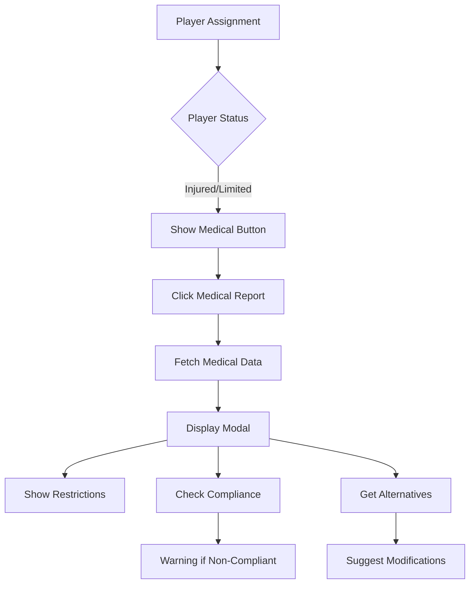

# Medical Integration Plan for Physical Trainer Dashboard

## 📋 Current State Summary

### ✅ What's Working
- [x] Physical Trainer Session Builder is functional
- [x] Player Assignment tab shows players with wellness status
- [x] Mock data includes injured players (Sidney Crosby) and limited players (Nathan MacKinnon)
- [x] Medical restrictions are displayed in player list
- [x] Progressive calorie calculation based on intensity and load

### 🏗️ Existing Medical Infrastructure
- [x] **Medical Service** (Port 3005) - Handles injuries, wellness, treatments
- [x] **Training Service** has `MedicalIntegrationService` for syncing restrictions
- [x] **Medical Staff Dashboard** exists with injury management features
- [x] **API endpoints** for medical data are established

### 🔗 Integration Points Discovered
- [x] `/api/v1/training/medical-sync/compliance/:sessionId` - Check session safety
- [x] `/api/v1/training/medical-sync/alternatives/:playerId` - Get exercise alternatives
- [x] `/api/v1/medical/players/:playerId/overview` - Get medical overview
- [x] Event bus system for medical updates

## 📝 Implementation Checklist

### Phase 1: Core Components
- [ ] Create `MedicalReportButton.tsx` component
  - [ ] Show only for injured/limited players
  - [ ] Include medical icon indicator
  - [ ] Handle click to open modal
  
- [ ] Create `MedicalReportModal.tsx` component
  - [ ] Player info header with injury status
  - [ ] Tabs for Overview, Restrictions, Alternatives, Documents
  - [ ] Recovery progress visualization
  - [ ] Restriction details display

- [ ] Create `MedicalRestrictionBadge.tsx` component
  - [ ] Severity color coding (mild=yellow, moderate=orange, severe=red)
  - [ ] Restriction type icons
  - [ ] Tooltip with details

### Phase 2: API Integration
- [ ] Add medical API slice to Redux store
  ```typescript
  // apps/frontend/src/store/api/trainingMedicalApi.ts
  endpoints: {
    getPlayerMedicalOverview: builder.query(),
    checkSessionCompliance: builder.query(),
    getExerciseAlternatives: builder.query(),
  }
  ```

- [ ] Update mock API handlers
  - [ ] Add medical overview endpoint
  - [ ] Add compliance check endpoint
  - [ ] Add alternatives endpoint
  - [ ] Include sample medical data

### Phase 3: Session Builder Enhancement
- [ ] Update `PlayerAssignment.tsx`
  - [ ] Add medical report button for injured players
  - [ ] Show restriction badges
  - [ ] Add compliance warnings

- [ ] Create `ComplianceWarning.tsx` component
  - [ ] Display when injured player selected
  - [ ] Show specific exercise violations
  - [ ] Suggest alternatives button

- [ ] Create `ExerciseAlternativesList.tsx`
  - [ ] List safe alternative exercises
  - [ ] Show modification instructions
  - [ ] Load/rest multipliers display

### Phase 4: Smart Features
- [ ] Automatic compliance checking
  - [ ] On player assignment
  - [ ] On exercise addition
  - [ ] Real-time validation

- [ ] Exercise modification system
  - [ ] Auto-apply load reductions
  - [ ] Suggest rest increases
  - [ ] Flag dangerous exercises

- [ ] Bulk assignment safety
  - [ ] Check team assignments
  - [ ] Generate compliance report
  - [ ] Batch alternatives

## 🏛️ Component Architecture

```
apps/frontend/src/features/physical-trainer/components/
├── SessionBuilder/
│   ├── PlayerAssignment.tsx (modify)
│   ├── MedicalReportModal.tsx (new)
│   ├── MedicalReportButton.tsx (new)
│   ├── MedicalRestrictionBadge.tsx (new)
│   ├── ComplianceWarning.tsx (new)
│   └── ExerciseAlternativesList.tsx (new)
└── hooks/
    └── useMedicalCompliance.ts (new)
```

## 📊 Data Flow



## 🔧 Technical Implementation Details

### Medical Report Modal Structure
```typescript
interface MedicalReportModalProps {
  playerId: string;
  isOpen: boolean;
  onClose: () => void;
  currentSession?: SessionTemplate;
}

interface PlayerMedicalData {
  overview: {
    currentInjuries: Injury[];
    restrictions: MedicalRestriction[];
    recoveryTimeline: RecoveryPhase[];
    clearanceStatus: 'full' | 'limited' | 'restricted';
  };
  compliance: {
    sessionId: string;
    status: 'compliant' | 'partial' | 'non_compliant';
    violations: ComplianceViolation[];
    recommendations: string[];
  };
  alternatives: {
    exerciseId: string;
    alternatives: AlternativeExercise[];
    modifications: ExerciseModification[];
  }[];
}
```

### Mock Data Structure
```typescript
const MOCK_MEDICAL_DATA = {
  'player-005': { // Sidney Crosby
    injuries: [{
      id: 'inj-001',
      type: 'Upper Body Injury',
      severity: 'moderate',
      bodyPart: 'shoulder',
      dateOccurred: '2024-12-15',
      estimatedReturn: '2025-02-01',
      restrictions: [
        'No overhead movements',
        'No contact drills',
        'Limited pushing exercises'
      ],
      maxExertionLevel: 60,
      requiresSupervision: true
    }],
    recoveryPhase: {
      current: 2,
      total: 4,
      phaseName: 'Strength Building',
      progress: 45
    }
  },
  'player-003': { // Nathan MacKinnon
    injuries: [{
      id: 'inj-002',
      type: 'Lower Back Strain',
      severity: 'mild',
      bodyPart: 'lower back',
      restrictions: ['No heavy squats'],
      maxExertionLevel: 80
    }]
  }
};
```

### API Endpoints to Mock
```typescript
// GET /api/v1/medical/players/:playerId/overview
// GET /api/v1/training/medical-sync/compliance/:sessionId?playerId=xxx
// GET /api/v1/training/medical-sync/alternatives/:playerId?exerciseIds=xxx
```

## 🎯 Key Features to Implement

### 1. Medical Report Button
- Show medical icon for injured/limited players
- Quick access without leaving session builder
- Visual severity indicator

### 2. Comprehensive Medical Modal
- **Overview Tab**: Current injuries, recovery timeline, clearance status
- **Restrictions Tab**: Movement limitations, exercise blacklist, intensity caps
- **Alternatives Tab**: Safe exercise substitutions with rationale
- **Documents Tab**: Medical reports, clearance forms, treatment notes

### 3. Automatic Compliance
- Real-time validation when assigning players
- Highlight non-compliant exercises in red
- Show specific violation reasons
- Require approval for overrides

### 4. Smart Alternatives
- AI-suggested exercise replacements
- Maintain training goals while respecting limits
- Progressive loading recommendations
- Equipment alternatives for restrictions

### 5. Integration Benefits
- Seamless workflow for trainers
- Improved player safety
- Better medical-training communication
- Compliance tracking and reporting

## 🚀 Quick Start for Next Session

1. Copy this plan to reference
2. Start with creating the `MedicalReportButton.tsx` component
3. Add mock medical data to `mockBaseQuery.ts`
4. Implement the modal with tabs
5. Test with Sidney Crosby (injured) and Nathan MacKinnon (limited)

## 📝 Notes from Previous Session

- Session Builder is working well with drag-and-drop
- Mock API system is in place and functional
- Player assignment shows 5 mock players correctly
- Need to maintain consistency with existing UI patterns
- Use existing Badge, Button, Modal components from shadcn/ui

## 🔗 Related Files

- `/apps/frontend/src/features/physical-trainer/components/SessionBuilder/PlayerAssignment.tsx`
- `/apps/frontend/src/store/api/mockBaseQuery.ts`
- `/services/training-service/src/services/MedicalIntegrationService.ts`
- `/apps/frontend/src/features/medical-staff/components/InjuryDetailModal.tsx` (reference)

---

**Remember**: The goal is to create a seamless integration where physical trainers can make informed decisions about injured players while respecting medical restrictions and optimizing recovery. The medical report button should feel like a natural extension of the player assignment workflow.