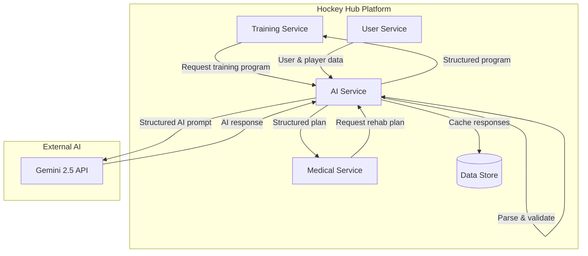

# Hockey Hub - AI Integration Strategy

## Overview

This document outlines the comprehensive strategy for integrating Google's Gemini 2.5 API into the Hockey Hub platform. AI capabilities will enhance two primary areas: training program generation and rehabilitation planning. This integration will provide intelligent assistance to coaches and medical staff while ensuring data privacy, cost management, and reliability.

## Table of Contents

1. [AI Integration Architecture](#ai-integration-architecture)
2. [Data Processing Flow](#data-processing-flow)
3. [Prompt Engineering Guidelines](#prompt-engineering-guidelines)
4. [Response Parsing & Error Handling](#response-parsing--error-handling)
5. [Cost Management](#cost-management)
6. [Data Privacy & Security](#data-privacy--security)
7. [Local Fallback Mechanism](#local-fallback-mechanism)
8. [Testing Strategy](#testing-strategy)
9. [Implementation Roadmap](#implementation-roadmap)
10. [Event Publication & Messaging](#event-publication--messaging)
11. [RLS & Data-Access Model](#rls--data-access-model)
12. [GDPR & Privacy Compliance](#gdpr--privacy-compliance)
13. [Alerting & Quota Thresholds](#alerting--quota-thresholds)

## AI Integration Architecture

The AI functionality is integrated as a dedicated microservice that provides AI capabilities to other services in the Hockey Hub platform.

### Architecture Overview



### Integration Components

1. **AI Service Microservice**
   - Dedicated service for AI operations
   - Handles all communication with Gemini API
   - Provides standardized interfaces for other services
   - Manages caching, rate limiting, and fallbacks

2. **Service Clients**
   - Training Service client for program generation
   - Medical Service client for rehabilitation planning
   - Standardized request/response formats
   - Error handling and retry logic

3. **Data Store**
   - Cache for AI responses to reduce API calls
   - Storage for generated programs and plans
   - Versioning for AI-generated content

### API Interfaces

The AI Service exposes the following REST endpoints:

#### Training Program Generation

```
POST /api/v1/ai/training-programs
```

**Request Body:**
```json
{
  "player": {
    "id": "string",
    "age": "number",
    "position": "string",
    "experience": "string",
    "testResults": [{
      "testId": "string",
      "name": "string",
      "value": "number",
      "unit": "string",
      "date": "string"
    }]
  },
  "parameters": {
    "focus": "string",
    "duration": "number",
    "intensity": "string",
    "equipment": ["string"],
    "phase": "string",
    "context": "string"
  },
  "constraints": {
    "injuries": [{
      "bodyPart": "string",
      "status": "string",
      "limitations": ["string"]
    }]
  }
}
```

**Response Body:**
```json
{
  "id": "string",
  "programName": "string",
  "description": "string",
  "sections": [{
    "name": "string",
    "duration": "number",
    "exercises": [{
      "name": "string",
      "sets": "number",
      "reps": "number",
      "intensity": {
        "type": "string",
        "value": "number",
        "reference": "string"
      },
      "rest": "number",
      "description": "string",
      "substitutes": ["string"]
    }]
  }],
  "notes": "string",
  "generatedAt": "string",
  "aiModel": "string",
  "version": "string"
}
```

#### Rehabilitation Planning

```
POST /api/v1/ai/rehab-plans
```

**Request Body:**
```json
{
  "player": {
    "id": "string",
    "age": "number",
    "position": "string",
    "injuryHistory": [{
      "bodyPart": "string",
      "type": "string",
      "date": "string",
      "duration": "number"
    }]
  },
  "injury": {
    "bodyPart": "string",
    "type": "string",
    "severity": "string",
    "mechanismOfInjury": "string",
    "dateOfInjury": "string",
    "symptoms": ["string"],
    "diagnosis": "string",
    "currentPhase": "string"
  },
  "parameters": {
    "duration": "number",
    "primaryGoals": ["string"],
    "availableEquipment": ["string"],
    "physioAvailability": "string"
  }
}
```

**Response Body:**
```json
{
  "id": "string",
  "planName": "string",
  "description": "string",
  "phases": [{
    "name": "string",
    "duration": "number",
    "goals": ["string"],
    "exercises": [{
      "name": "string",
      "sets": "number",
      "reps": "number",
      "frequency": "string",
      "precautions": ["string"],
      "progressionCriteria": ["string"],
      "description": "string"
    }],
    "milestones": ["string"],
    "warnings": ["string"]
  }],
  "precautions": ["string"],
  "expectedRecoveryTimeline": "string",
  "generatedAt": "string",
  "aiModel": "string",
  "version": "string"
}
```

## Data Processing Flow

### Training Program Generation Flow

1. **Data Collection**
   - Training Service gathers player data:
     - Physical characteristics
     - Recent test results
     - Training history
     - Current physical condition
     - Any injuries or limitations

2. **Context Enrichment**
   - Add team context (season phase, schedule)
   - Add sport-specific requirements
   - Include coach preferences

3. **Data Anonymization**
   - Remove personally identifiable information
   - Generate temporary player identifier
   - Retain only relevant attributes

4. **AI Request Preparation**
   - Format data into structured prompt
   - Add system instructions and constraints
   - Set response format requirements

5. **API Interaction**
   - Send request to Gemini API
   - Receive and validate response
   - Retry with backoff on transient errors

6. **Response Processing**
   - Parse JSON structure
   - Validate against schema
   - Map exercise names to existing exercise library
   - Convert intensity values based on player data

7. **Program Creation**
   - Store program in database
   - Link to player profile
   - Make available in Training Service

### Rehabilitation Planning Flow

1. **Data Collection**
   - Medical Service gathers:
     - Injury details
     - Player medical history
     - Current assessment data
     - Recovery goals
     - Rehab environment limitations

2. **Medical Context Enrichment**
   - Add evidence-based protocols for injury type
   - Include recovery phase information
   - Add sport-specific return-to-play criteria

3. **Data Anonymization**
   - Remove personal identifiers
   - Retain medical and functional data only
   - Use temporary identifiers

4. **AI Request Preparation**
   - Structure prompt with medical context
   - Include specific constraints and protocols
   - Format expected response structure

5. **API Interaction**
   - Send request to Gemini API
   - Monitor response time and quality
   - Handle errors appropriately

6. **Response Processing**
   - Validate against medical protocols
   - Ensure safety guidelines are met
   - Map to standard exercise terminology
   - Add appropriate warnings and precautions

7. **Plan Creation**
   - Store rehabilitation plan
   - Link to injury record
   - Make available in Medical Service

## Prompt Engineering Guidelines

Effective prompt engineering is critical for generating high-quality, relevant, and safe AI responses. The following guidelines should be followed:

### Prompt Structure

All prompts should follow this general structure:

```
[SYSTEM INSTRUCTION]
You are an expert sports trainer/rehabilitation specialist with deep knowledge of hockey.
Your task is to create a [training program/rehabilitation plan] based on the information provided.
Follow these guidelines carefully:
- Format your response as valid JSON following the provided schema
- Ensure all exercises are appropriate for the player's condition
- Include appropriate intensities based on test results
- Always prioritize safety and proper progression
- Include appropriate alternatives/modifications

[CONTEXT]
Player Information: {player_data}
Request Parameters: {parameters}
Constraints: {constraints}

[RESPONSE FORMAT]
Respond with valid JSON following this schema:
{schema_definition}

[ADDITIONAL GUIDELINES]
- Do not include exercises that violate the specified constraints
- Ensure all intensity values are based on provided test results
- Include detailed descriptions for each exercise
- Add notes explaining the rationale behind the program design
```

### Training Program Prompt Template

```
You are an expert hockey strength and conditioning coach with experience creating personalized training programs. Your task is to create a training program based on the information provided about the player and the requested parameters.

PLAYER INFORMATION:
- Age: {{player.age}}
- Position: {{player.position}}
- Physical test results: 
  {{#each player.testResults}}
  - {{this.name}}: {{this.value}} {{this.unit}} (tested on {{this.date}})
  {{/each}}

PROGRAM PARAMETERS:
- Training focus: {{parameters.focus}}
- Duration: {{parameters.duration}} minutes
- Training phase: {{parameters.phase}}
- Available equipment: {{parameters.equipment}}

CONSTRAINTS:
{{#if constraints.injuries}}
- Injuries/limitations:
  {{#each constraints.injuries}}
  - {{this.bodyPart}}: {{this.status}} (Limitations: {{this.limitations}})
  {{/each}}
{{/if}}

RESPONSE GUIDELINES:
1. Create a structured workout program as JSON that follows these principles:
   - Appropriate exercises for a hockey player in the specified position
   - Exercises that support the training focus
   - Safe progression considering the player's current abilities
   - Appropriate intensity based on test results
   - Modifications to accommodate any injuries or limitations

2. Include these sections:
   - Warm-up (dynamic and specific)
   - Main workout section(s)
   - Cool-down/recovery

3. For each exercise, specify:
   - Exercise name
   - Sets and repetitions or duration
   - Intensity (as percentage of max, RPE, or specific load)
   - Rest periods
   - Brief description of proper execution
   - Alternative exercises if applicable

FORMAT YOUR RESPONSE AS VALID JSON FOLLOWING THIS EXACT SCHEMA:
{
  "programName": string,
  "description": string,
  "sections": [
    {
      "name": string,
      "duration": number,
      "exercises": [
        {
          "name": string,
          "sets": number,
          "reps": number,
          "intensity": {
            "type": string,
            "value": number,
            "reference": string
          },
          "rest": number,
          "description": string,
          "substitutes": [string]
        }
      ]
    }
  ],
  "notes": string
}
```

### Rehabilitation Plan Prompt Template

```
You are an expert sports physiotherapist specializing in hockey injuries and rehabilitation. Your task is to create a rehabilitation plan based on the information provided about the player and their injury.

PLAYER INFORMATION:
- Age: {{player.age}}
- Position: {{player.position}}
- Injury history:
  {{#each player.injuryHistory}}
  - {{this.bodyPart}} {{this.type}} ({{this.date}}, duration: {{this.duration}} days)
  {{/each}}

CURRENT INJURY DETAILS:
- Body part: {{injury.bodyPart}}
- Injury type: {{injury.type}}
- Severity: {{injury.severity}}
- Mechanism of injury: {{injury.mechanismOfInjury}}
- Date of injury: {{injury.dateOfInjury}}
- Symptoms: {{injury.symptoms}}
- Diagnosis: {{injury.diagnosis}}
- Current phase: {{injury.currentPhase}}

REHABILITATION PARAMETERS:
- Duration: {{parameters.duration}} weeks
- Primary goals: {{parameters.primaryGoals}}
- Available equipment: {{parameters.availableEquipment}}
- Physiotherapist availability: {{parameters.physioAvailability}}

RESPONSE GUIDELINES:
1. Create a phased rehabilitation plan as JSON that follows these principles:
   - Evidence-based approach for the specific injury
   - Progressive loading appropriate for the current phase
   - Hockey-specific functional progression
   - Safe return-to-play guidelines
   - Clear precautions and contraindications

2. Include these phases as appropriate for the injury:
   - Acute/protection phase
   - Repair/regeneration phase
   - Remodeling/functional phase
   - Return to sport phase

3. For each phase, include:
   - Phase goals and duration
   - Specific exercises with parameters
   - Progression criteria to next phase
   - Precautions and warning signs
   - Expected milestones

FORMAT YOUR RESPONSE AS VALID JSON FOLLOWING THIS EXACT SCHEMA:
{
  "planName": string,
  "description": string,
  "phases": [
    {
      "name": string,
      "duration": number,
      "goals": [string],
      "exercises": [
        {
          "name": string,
          "sets": number,
          "reps": number,
          "frequency": string,
          "precautions": [string],
          "progressionCriteria": [string],
          "description": string
        }
      ],
      "milestones": [string],
      "warnings": [string]
    }
  ],
  "precautions": [string],
  "expectedRecoveryTimeline": string
}
```

### Prompt Best Practices

1. **Be Specific and Clear**
   - Clearly define the expected output format
   - Provide detailed context relevant to the task
   - Specify constraints and limitations

2. **Include Domain Knowledge**
   - Reference hockey-specific terminology
   - Incorporate sport science principles
   - Include medical best practices for rehabilitation

3. **Set Output Structure**
   - Define exact JSON schema for responses
   - Include all required fields
   - Specify data types and validation rules

4. **Add Safety Guardrails**
   - Include warnings about contraindications
   - Require precautions for injury cases
   - Set boundaries for intensity recommendations

5. **Enable Reasoning**
   - Ask for explanations of recommendations
   - Request notes on program design rationale
   - Include adaptability guidelines

## Response Parsing & Error Handling

### Response Validation

All responses from the Gemini API must be validated to ensure they meet the requirements and are safe to use:

1. **Schema Validation**
   - Validate JSON structure against expected schema
   - Check all required fields are present
   - Verify data types are correct

2. **Content Validation**
   - Ensure exercise names match the exercise library
   - Verify intensity values are within safe ranges
   - Check for appropriate exercises given constraints
   - Validate all recommendations against safety guidelines

3. **Safety Checks**
   - Flag potentially risky exercises for review
   - Check for contradictions with injury constraints
   - Verify progression rates are appropriate

### Response Parsing Implementation

```typescript
// src/services/ai/responseParser.ts
import { z } from 'zod';
import { ExerciseLibraryService } from '../exerciseLibrary';

// Define schema for validation
const intensitySchema = z.object({
  type: z.enum(['percentage_1rm', 'percentage_max_hr', 'rpe', 'speed']),
  value: z.number().min(0).max(100),
  reference: z.string().optional(),
});

const exerciseSchema = z.object({
  name: z.string(),
  sets: z.number().int().min(1),
  reps: z.number().int().min(1).optional(),
  duration: z.number().min(1).optional(),
  intensity: intensitySchema.optional(),
  rest: z.number().min(0).optional(),
  description: z.string(),
  substitutes: z.array(z.string()).optional(),
});

const sectionSchema = z.object({
  name: z.string(),
  duration: z.number().min(1),
  exercises: z.array(exerciseSchema),
});

const trainingProgramSchema = z.object({
  programName: z.string(),
  description: z.string(),
  sections: z.array(sectionSchema),
  notes: z.string(),
});

// Response parser class
export class TrainingProgramParser {
  private exerciseLibrary: ExerciseLibraryService;
  
  constructor(exerciseLibrary: ExerciseLibraryService) {
    this.exerciseLibrary = exerciseLibrary;
  }
  
  async parseResponse(responseText: string): Promise<any> {
    try {
      // Extract JSON from response
      const jsonMatch = responseText.match(/```json\n([\s\S]*?)\n```/) || 
                        responseText.match(/{[\s\S]*}/);
                        
      if (!jsonMatch) {
        throw new Error('No valid JSON found in response');
      }
      
      const jsonString = jsonMatch[1] || jsonMatch[0];
      const parsedJson = JSON.parse(jsonString);
      
      // Validate against schema
      const validationResult = trainingProgramSchema.safeParse(parsedJson);
      
      if (!validationResult.success) {
        throw new Error(`Schema validation failed: ${validationResult.error.message}`);
      }
      
      // Validate exercise names against library
      await this.validateExercises(validationResult.data);
      
      // Perform safety checks
      this.performSafetyChecks(validationResult.data);
      
      return validationResult.data;
    } catch (error) {
      throw new Error(`Response parsing failed: ${error.message}`);
    }
  }
  
  private async validateExercises(program: any): Promise<void> {
    const exercisePromises = program.sections.flatMap(section => 
      section.exercises.map(async (exercise: any) => {
        const exists = await this.exerciseLibrary.exerciseExists(exercise.name);
        if (!exists) {
          // Map to closest match or flag for review
          const suggestion = await this.exerciseLibrary.findSimilarExercise(exercise.name);
          if (suggestion) {
            exercise.name = suggestion;
            exercise.flagged = true;
            exercise.originalName = exercise.name;
          } else {
            exercise.needsReview = true;
          }
        }
        return exercise;
      })
    );
    
    await Promise.all(exercisePromises);
  }
  
  private performSafetyChecks(program: any): void {
    // Implement safety checks
    // e.g., check intensity levels, exercise combinations, etc.
  }
}
```

### Error Handling Strategy

The AI Service implements a robust error handling strategy:

1. **Error Categories**
   - **Input Errors**: Invalid or incomplete request data
   - **API Errors**: Errors from the Gemini API
   - **Parsing Errors**: Failures in response parsing
   - **Validation Errors**: Response fails validation
   - **Safety Errors**: Content deemed unsafe or inappropriate

2. **Error Handling Approach**
   - Detailed error logging with context
   - Structured error responses
   - Retry strategy for transient errors
   - Graceful degradation to fallback mechanisms

3. **Error Response Format**

```json
{
  "error": true,
  "code": "ERROR_CODE",
  "category": "ERROR_CATEGORY",
  "message": "Human-readable error message",
  "details": {
    "specific": "error details",
    "location": "where the error occurred",
    "suggestion": "potential resolution"
  },
  "requestId": "unique-request-id",
  "timestamp": "ISO timestamp"
}
```

### Error Handling Implementation

```typescript
// src/services/ai/errorHandler.ts
export enum ErrorCategory {
  INPUT_ERROR = 'INPUT_ERROR',
  API_ERROR = 'API_ERROR',
  PARSING_ERROR = 'PARSING_ERROR',
  VALIDATION_ERROR = 'VALIDATION_ERROR',
  SAFETY_ERROR = 'SAFETY_ERROR',
  FALLBACK_ERROR = 'FALLBACK_ERROR',
  UNKNOWN_ERROR = 'UNKNOWN_ERROR'
}

export class AIServiceError extends Error {
  code: string;
  category: ErrorCategory;
  details: any;
  requestId?: string;
  
  constructor(
    message: string,
    code: string,
    category: ErrorCategory,
    details?: any,
    requestId?: string
  ) {
    super(message);
    this.name = 'AIServiceError';
    this.code = code;
    this.category = category;
    this.details = details;
    this.requestId = requestId;
  }
  
  toResponse() {
    return {
      error: true,
      code: this.code,
      category: this.category,
      message: this.message,
      details: this.details,
      requestId: this.requestId,
      timestamp: new Date().toISOString()
    };
  }
}

export class ErrorHandler {
  static handleGeminiError(error: any, requestId?: string): AIServiceError {
    // Handle specific Gemini API errors
    if (error.response) {
      const status = error.response.status;
      
      if (status === 400) {
        return new AIServiceError(
          'Invalid request to AI service',
          'GEMINI_INVALID_REQUEST',
          ErrorCategory.API_ERROR,
          error.response.data,
          requestId
        );
      } else if (status === 401 || status === 403) {
        return new AIServiceError(
          'Authentication error with AI service',
          'GEMINI_AUTH_ERROR',
          ErrorCategory.API_ERROR,
          error.response.data,
          requestId
        );
      } else if (status === 429) {
        return new AIServiceError(
          'AI service quota exceeded',
          'GEMINI_QUOTA_EXCEEDED',
          ErrorCategory.API_ERROR,
          { retryAfter: error.response.headers['retry-after'] },
          requestId
        );
      } else if (status >= 500) {
        return new AIServiceError(
          'AI service internal error',
          'GEMINI_SERVER_ERROR',
          ErrorCategory.API_ERROR,
          error.response.data,
          requestId
        );
      }
    }
    
    // Network or unknown errors
    return new AIServiceError(
      'Error communicating with AI service',
      'GEMINI_COMMUNICATION_ERROR',
      ErrorCategory.API_ERROR,
      { originalError: error.message },
      requestId
    );
  }
  
  static handleParsingError(error: any, requestId?: string): AIServiceError {
    return new AIServiceError(
      'Failed to parse AI response',
      'PARSING_ERROR',
      ErrorCategory.PARSING_ERROR,
      { originalError: error.message },
      requestId
    );
  }
  
  static handleValidationError(error: any, requestId?: string): AIServiceError {
    return new AIServiceError(
      'AI response failed validation',
      'VALIDATION_ERROR',
      ErrorCategory.VALIDATION_ERROR,
      { validationErrors: error.details || error.message },
      requestId
    );
  }
  
  static handleInputError(error: any, requestId?: string): AIServiceError {
    return new AIServiceError(
      'Invalid input for AI request',
      'INPUT_ERROR',
      ErrorCategory.INPUT_ERROR,
      { validationErrors: error.details || error.message },
      requestId
    );
  }
}
```

### Retry Strategy

For transient errors, a retry strategy is implemented:

```typescript
// src/services/ai/retryStrategy.ts
import { sleep } from '../../utils/sleep';
import { ErrorCategory, AIServiceError } from './errorHandler';
import { logger } from '../../utils/logger';

interface RetryOptions {
  maxRetries: number;
  initialDelayMs: number;
  maxDelayMs: number;
  backoffFactor: number;
  retryableCategories: ErrorCategory[];
}

const defaultRetryOptions: RetryOptions = {
  maxRetries: 3,
  initialDelayMs: 1000,
  maxDelayMs: 10000,
  backoffFactor: 2,
  retryableCategories: [ErrorCategory.API_ERROR]
};

export async function withRetry<T>(
  operation: () => Promise<T>,
  options: Partial<RetryOptions> = {}
): Promise<T> {
  const retryOptions = { ...defaultRetryOptions, ...options };
  let lastError: Error | null = null;
  let delay = retryOptions.initialDelayMs;
  
  for (let attempt = 1; attempt <= retryOptions.maxRetries; attempt++) {
    try {
      return await operation();
    } catch (error) {
      lastError = error;
      
      // Check if error is retryable
      if (error instanceof AIServiceError && 
          retryOptions.retryableCategories.includes(error.category)) {
        
        // Special handling for rate limit errors
        if (error.code === 'GEMINI_QUOTA_EXCEEDED' && error.details?.retryAfter) {
          delay = parseInt(error.details.retryAfter, 10) * 1000 || delay;
        }
        
        // Don't retry on last attempt
        if (attempt < retryOptions.maxRetries) {
          logger.warn(`Retrying operation after error: ${error.message} (Attempt ${attempt}/${retryOptions.maxRetries})`);
          await sleep(delay);
          delay = Math.min(delay * retryOptions.backoffFactor, retryOptions.maxDelayMs);
          continue;
        }
      }
      
      // Non-retryable error or max retries reached
      throw error;
    }
  }
  
  // This should not be reached due to the throw in the loop,
  // but TypeScript requires a return statement
  throw lastError || new Error('Unknown error in retry mechanism');
}
```

## Cost Management

Effective cost management is critical for sustainable AI integration. The Hockey Hub platform implements several strategies to control and optimize Gemini API usage costs.

### Usage Monitoring

1. **Request Tracking**
   - Count requests by service and function
   - Track token usage for each request
   - Aggregate daily and monthly usage
   - Generate cost reports

2. **Usage Dashboard**
   - Real-time usage metrics
   - Forecasted monthly costs
   - Usage trends and anomaly detection
   - Cost allocation by service

3. **Quota Management**
   - Set monthly budget caps
   - Apply service-specific quotas
   - Configure user/team usage limits
   - Implement graduated throttling

### Cost Optimization Strategies

1. **Caching**
   - Cache similar queries and responses
   - Implement time-based cache invalidation
   - Prioritize cache for common requests
   - Use Redis for distributed caching

2. **Request Optimization**
   - Minimize prompt size through efficient formatting
   - Use compression for context data
   - Batch similar requests when possible
   - Apply context distillation techniques

3. **Service Tiers**
   - Basic tier: Limited AI features
   - Premium tier: More extensive AI assistance
   - Custom tier: Organization-specific limits
   - Usage-based pricing model

4. **Fallback Mechanisms**
   - Rule-based systems for common cases
   - Template-based generation when suitable
   - Feature degradation under high load
   - Scheduled vs. on-demand generation

### Cost Management Implementation

```typescript
// src/services/ai/costManager.ts
import { RedisClient } from '../redis';
import { config } from '../../config';
import { logger } from '../../utils/logger';

interface UsageMetrics {
  requestCount: number;
  inputTokens: number;
  outputTokens: number;
  estimatedCost: number;
}

export class AICostManager {
  private redis: RedisClient;
  private readonly costPerInputToken: number;
  private readonly costPerOutputToken: number;
  private readonly monthlyBudget: number;
  private readonly quotaGracePeriod: number;
  private readonly cacheEnabled: boolean;
  private readonly cacheTTLSeconds: number;
  
  constructor(redis: RedisClient) {
    this.redis = redis;
    this.costPerInputToken = config.ai.gemini.costPerInputToken;
    this.costPerOutputToken = config.ai.gemini.costPerOutputToken;
    this.monthlyBudget = config.ai.gemini.monthlyBudget;
    this.quotaGracePeriod = config.ai.gemini.quotaGracePeriod || 0.1; // 10% over budget allowed
    this.cacheEnabled = config.ai.gemini.cacheEnabled ?? true;
    this.cacheTTLSeconds = config.ai.gemini.cacheTTLSeconds ?? 86400; // 24 hours default
  }
  
  async trackUsage(
    service: string, 
    function: string, 
    inputTokens: number,
    outputTokens: number
  ): Promise<void> {
    const date = new Date();
    const month = `${date.getFullYear()}-${(date.getMonth() + 1).toString().padStart(2, '0')}`;
    const day = `${month}-${date.getDate().toString().padStart(2, '0')}`;
    
    const cost = this.calculateCost(inputTokens, outputTokens);
    
    // Track in various dimensions
    await Promise.all([
      // Monthly total
      this.incrementUsage(`usage:month:${month}`, inputTokens, outputTokens, cost),
      
      // Daily total
      this.incrementUsage(`usage:day:${day}`, inputTokens, outputTokens, cost),
      
      // Service monthly
      this.incrementUsage(`usage:month:${month}:service:${service}`, inputTokens, outputTokens, cost),
      
      // Function monthly
      this.incrementUsage(`usage:month:${month}:service:${service}:function:${function}`, inputTokens, outputTokens, cost),
    ]);
    
    logger.debug(`AI usage tracked: ${service}.${function}, ${inputTokens} input tokens, ${outputTokens} output tokens, $${cost.toFixed(4)}`);
  }
  
  private async incrementUsage(
    key: string, 
    inputTokens: number,
    outputTokens: number,
    cost: number
  ): Promise<void> {
    await this.redis.hIncrBy(key, 'requestCount', 1);
    await this.redis.hIncrBy(key, 'inputTokens', inputTokens);
    await this.redis.hIncrBy(key, 'outputTokens', outputTokens);
    
    // For cost, we need to use string representation since Redis doesn't handle floats directly
    const currentCost = parseFloat(await this.redis.hGet(key, 'estimatedCost') || '0');
    await this.redis.hSet(key, 'estimatedCost', (currentCost + cost).toString());
  }
  
  async checkBudget(): Promise<boolean> {
    const date = new Date();
    const month = `${date.getFullYear()}-${(date.getMonth() + 1).toString().padStart(2, '0')}`;
    
    const usageData = await this.redis.hGetAll(`usage:month:${month}`);
    const currentCost = parseFloat(usageData.estimatedCost || '0');
    
    // Allow slight overage to prevent sudden cutoffs
    const adjustedBudget = this.monthlyBudget * (1 + this.quotaGracePeriod);
    
    // Check if we're over budget
    if (currentCost >= adjustedBudget) {
      logger.warn(`AI budget exceeded: ${currentCost.toFixed(2)} / ${this.monthlyBudget.toFixed(2)}`);
      return false;
    }
    
    // Check if we're approaching budget
    if (currentCost >= this.monthlyBudget * 0.9) {
      logger.warn(`AI budget nearly exhausted: ${currentCost.toFixed(2)} / ${this.monthlyBudget.toFixed(2)}`);
    }
    
    return true;
  }
  
  private calculateCost(inputTokens: number, outputTokens: number): number {
    return (inputTokens * this.costPerInputToken) + (outputTokens * this.costPerOutputToken);
  }
  
  async getUsageMetrics(period: 'day' | 'month' = 'month'): Promise<UsageMetrics> {
    const date = new Date();
    const month = `${date.getFullYear()}-${(date.getMonth() + 1).toString().padStart(2, '0')}`;
    const day = `${month}-${date.getDate().toString().padStart(2, '0')}`;
    
    const key = period === 'day' ? `usage:day:${day}` : `usage:month:${month}`;
    const data = await this.redis.hGetAll(key);
    
    return {
      requestCount: parseInt(data.requestCount || '0', 10),
      inputTokens: parseInt(data.inputTokens || '0', 10),
      outputTokens: parseInt(data.outputTokens || '0', 10),
      estimatedCost: parseFloat(data.estimatedCost || '0')
    };
  }
  
  async getServiceMetrics(service: string, period: 'day' | 'month' = 'month'): Promise<UsageMetrics> {
    const date = new Date();
    const month = `${date.getFullYear()}-${(date.getMonth() + 1).toString().padStart(2, '0')}`;
    const day = `${month}-${date.getDate().toString().padStart(2, '0')}`;
    
    const key = period === 'day' 
      ? `usage:day:${day}:service:${service}` 
      : `usage:month:${month}:service:${service}`;
      
    const data = await this.redis.hGetAll(key);
    
    return {
      requestCount: parseInt(data.requestCount || '0', 10),
      inputTokens: parseInt(data.inputTokens || '0', 10),
      outputTokens: parseInt(data.outputTokens || '0', 10),
      estimatedCost: parseFloat(data.estimatedCost || '0')
    };
  }
  
  // Cache-related methods for cost optimization
  
  async getCachedResponse(prompt: string): Promise<string | null> {
    if (!this.cacheEnabled) {
      return null;
    }
    
    // Create a hash of the prompt to use as cache key
    const promptHash = this.createHash(prompt);
    const key = `ai:cache:${promptHash}`;
    
    return this.redis.get(key);
  }
  
  async setCachedResponse(prompt: string, response: string): Promise<void> {
    if (!this.cacheEnabled) {
      return;
    }
    
    // Create a hash of the prompt to use as cache key
    const promptHash = this.createHash(prompt);
    const key = `ai:cache:${promptHash}`;
    
    await this.redis.set(key, response, 'EX', this.cacheTTLSeconds);
    logger.debug(`AI response cached with key ${key}, TTL: ${this.cacheTTLSeconds}s`);
  }
  
  private createHash(text: string): string {
    // Simple hash function for demo purposes
    // In production, use a proper crypto hash function
    const crypto = require('crypto');
    return crypto.createHash('sha256').update(text).digest('hex');
  }
}

// Example usage in AI Service:
// src/services/ai/aiService.ts

export class AIService {
  private costManager: AICostManager;
  private geminiClient: GeminiClient;
  private fallbackGenerator: FallbackGenerator;
  
  constructor(
    costManager: AICostManager,
    geminiClient: GeminiClient,
    fallbackGenerator: FallbackGenerator
  ) {
    this.costManager = costManager;
    this.geminiClient = geminiClient;
    this.fallbackGenerator = fallbackGenerator;
  }
  
  async generateTrainingProgram(request: TrainingProgramRequest): Promise<TrainingProgram> {
    const requestId = uuidv4();
    
    try {
      // Validate request
      this.validateTrainingProgramRequest(request);
      
      // Prepare prompt
      const prompt = this.buildTrainingProgramPrompt(request);
      
      // Check budget
      const budgetOk = await this.costManager.checkBudget();
      if (!budgetOk) {
        logger.warn(`AI budget exceeded, using fallback for training program, requestId=${requestId}`);
        return this.fallbackGenerator.generateTrainingProgram(request);
      }
      
      // Check cache
      const cachedResponse = await this.costManager.getCachedResponse(prompt);
      if (cachedResponse) {
        logger.info(`Using cached AI response for training program, requestId=${requestId}`);
        const parser = new TrainingProgramParser(exerciseLibraryService);
        return await parser.parseResponse(cachedResponse);
      }
      
      // Generate response from Gemini API
      const response = await withRetry(() => this.geminiClient.generateContent(prompt));
      
      // Track usage
      await this.costManager.trackUsage(
        'training-service',
        'generate-program',
        response.promptTokenCount,
        response.responseTokenCount
      );
      
      // Cache response
      await this.costManager.setCachedResponse(prompt, response.text);
      
      // Parse and validate response
      const parser = new TrainingProgramParser(exerciseLibraryService);
      const program = await parser.parseResponse(response.text);
      
      return program;
    } catch (error) {
      // Handle different types of errors
      if (error instanceof AIServiceError) {
        throw error;
      } else if (error.name === 'ValidationError') {
        throw ErrorHandler.handleInputError(error, requestId);
      } else {
        logger.error(`Unexpected error in training program generation: ${error.message}`, {
          error,
          requestId,
          stack: error.stack
        });
        
        // Fall back to rule-based generation
        logger.info(`Using fallback for training program due to error, requestId=${requestId}`);
        return this.fallbackGenerator.generateTrainingProgram(request);
      }
    }
  }
}
```

## Event Publication & Messaging

After a program or rehab plan is generated and stored, the AI Service publishes a domain event over RabbitMQ so interested services (Training, Medical, Notification) can react without tight coupling.

| Event Key | Payload | Consumer Examples |
|-----------|---------|-------------------|
| `ai.training_program.created` | `{ programId, playerId, createdBy, version }` | Training Service cache refresh, Communication Service notify coach |
| `ai.rehab_plan.created` | `{ planId, injuryId, playerId, createdBy, version }` | Medical Service notifications, Calendar Service schedule sessions |

Events are published to the `ai` topic exchange with per‑service queues.  Consumers must acknowledge within 30 s; otherwise messages are re‑queued.

## RLS & Data‑Access Model
The AI Service **never** connects directly to PostgreSQL tables that contain player data.  Instead it uses gRPC/REST calls to Training and Medical services, which apply Row‑Level‑Security policies.  This ensures consistency with the RLS matrix and avoids privilege escalation.

## GDPR & Privacy Compliance
1. All prompts sent to Gemini omit personal identifiers (names, birth dates).  Only pseudonymised IDs are used.  
2. AI responses are stored with a `generated_by_ai` flag and version.  Users can request deletion, and the data will be cascaded.  
3. Logs redact any prompt content that might reveal personal data.  
4. Data Processing Agreement (DPA) with Google is retained in compliance docs.

## Alerting & Quota Thresholds
Cost manager emits Prometheus metrics `ai_tokens_total` & `ai_cost_estimate_total`.  Alerts:
* `AI_BUDGET_80_PERCENT` – cost ≥ 80 % of monthly budget (warning).  
* `AI_BUDGET_EXCEEDED` – cost ≥ 100 % (critical, automatic fallback only).

---
*Last updated 2024‑03‑14 for messaging, RLS, GDPR compliance, and alerting.*