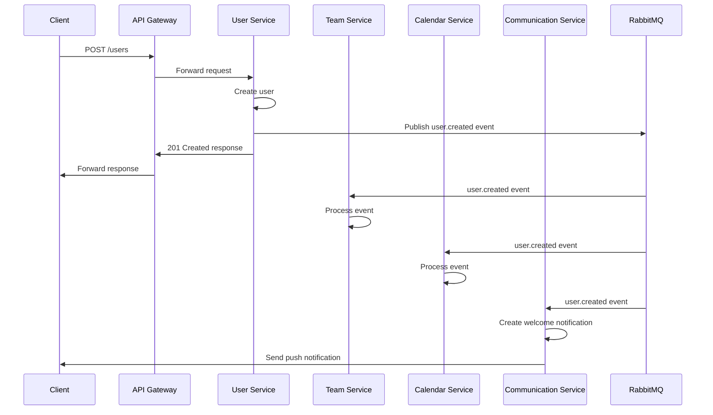
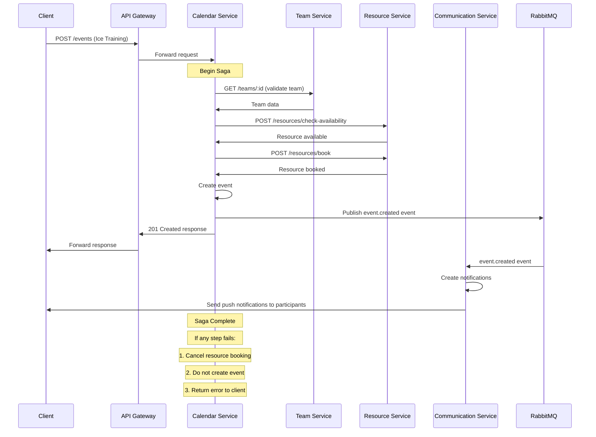

# Hockey App - Inter-Service Communication Patterns

## Overview

This document defines the communication patterns and protocols used between microservices in the Hockey App platform. Proper inter-service communication is critical for maintaining system reliability, consistency, and resilience in a distributed architecture.

## Communication Types

The Hockey App platform uses three primary types of inter-service communication:

### 1. Synchronous Request-Response

Used for direct service-to-service calls when an immediate response is required.

**Technology**: REST API calls via HTTP
**Use Cases**: 
- Data retrieval operations
- Operations requiring immediate confirmation
- Simple CRUD operations that don't span multiple services

**Implementation Details**:
- Uses standard HTTP methods (GET, POST, PUT, DELETE)
- JSON payloads for request/response bodies
- Status codes follow HTTP conventions
- Authentication via service-to-service JWT tokens

### 2. Asynchronous Event-Based

Used for operations that don't require immediate responses or for broadcasting state changes to interested services.

**Technology**: RabbitMQ message broker
**Use Cases**:
- Notifying other services of state changes (e.g., user updated, team created)
- Workflows that don't require immediate completion
- Fan-out operations where multiple services need to be notified

**Implementation Details**:
- Publisher/Subscriber pattern
- Topic-based exchanges for routing
- Durable queues for reliability
- Dead letter queues for handling failed messages
- Message acknowledgments to ensure delivery

### 3. Distributed Transactions (Saga Pattern)

Used for complex operations that span multiple services where atomicity is important.

**Technology**: Combination of REST calls and RabbitMQ messages with orchestration
**Use Cases**:
- Operations that modify data across multiple services
- Processes requiring compensation/rollback if steps fail
- Complex business workflows with multiple stages

**Implementation Details**:
- Orchestration-based sagas for complex flows
- Choreography-based sagas for simpler flows
- Compensating transactions for rollbacks
- Unique transaction IDs for correlation
- Idempotent operations to handle retries

## Service-to-Service Authentication

### JWT-based Service Authentication

All service-to-service communication uses JWT tokens for authentication.

**Implementation Details**:
- Each service has its own service account
- Service tokens have different claims than user tokens
- Tokens include:
  - Service identifier (sub claim)
  - Issuer (iss claim)
  - Audience (aud claim targeting specific service)
  - Expiration (exp claim - short-lived, 5 minutes)
  - Issued at (iat claim)
  - Scope (scope claim for authorization)
- Tokens are signed with RS256 (asymmetric signing)
- Public key distribution via API Gateway

### API Gateway Role

The API Gateway handles user authentication and passes appropriate service context:

1. User authenticates with the API Gateway
2. API Gateway validates user token
3. API Gateway adds necessary user context headers when proxying to internal services
4. Services can trust headers coming from the Gateway (internal network)

For direct service-to-service calls (bypassing Gateway):
1. Calling service obtains a service token from Auth Service
2. Token is included in the Authorization header
3. Called service validates the token before processing

## Circuit Breaker Pattern

To prevent cascading failures across services, the Hockey App implements circuit breakers.

### Configuration

Each service uses Resilience4j to implement circuit breakers with the following parameters:

```java
CircuitBreakerConfig circuitBreakerConfig = CircuitBreakerConfig.custom()
  .failureRateThreshold(50)                   // When 50% of calls fail...
  .slidingWindowType(SlidingWindowType.COUNT_BASED)
  .slidingWindowSize(10)                      // Over the last 10 calls
  .minimumNumberOfCalls(5)                    // After at least 5 calls
  .waitDurationInOpenState(Duration.ofSeconds(10)) // Wait 10s before trying again
  .permittedNumberOfCallsInHalfOpenState(3)   // Allow 3 test calls
  .automaticTransitionFromOpenToHalfOpenEnabled(true)
  .build();
```

### Circuit States

1. **CLOSED**: Normal operation, calls are passing through
2. **OPEN**: Circuit is open, calls immediately return with error
3. **HALF_OPEN**: Testing if service has recovered, allows limited calls

### Implementation Details

- Circuit breakers are configured for all external service calls
- Each service-to-service endpoint has its own circuit breaker instance
- Circuit breaker state is monitored and exposed via metrics
- Fallback mechanisms are implemented where appropriate

## Timeout & Retry Configuration

### Timeouts

```java
TimeLimiterConfig timeLimiterConfig = TimeLimiterConfig.custom()
  .timeoutDuration(Duration.ofSeconds(2))    // Request timeout after 2 seconds
  .cancelRunningFuture(true)                 // Cancel the running task on timeout
  .build();
```

### Retry Policy

```java
RetryConfig retryConfig = RetryConfig.custom()
  .maxAttempts(3)                            // Maximum 3 attempts
  .waitDuration(Duration.ofMillis(500))      // Initial wait 500ms
  .retryExceptions(
    ConnectException.class, 
    IOException.class,
    TimeoutException.class
  )                                          // Retry only on network errors
  .ignoreExceptions(
    IllegalArgumentException.class,
    BadRequestException.class
  )                                          // Don't retry on client errors
  .retryOnResult(response -> 
    response instanceof HttpResponse && 
    ((HttpResponse)response).getStatus() >= 500
  )                                          // Retry on 5xx responses
  .exponentialBackoff()                      // Exponential backoff between retries
  .build();
```

## Saga Pattern Implementation

The Hockey App implements both orchestration and choreography-based saga patterns for different scenarios.

### Orchestration-based Saga

Used for complex workflows requiring central coordination.

**Example: Player Registration Process**

1. **User Service**: Create user account
2. **Team Service**: Add player to team
3. **Medical Service**: Create initial medical record
4. **Training Service**: Set up default training profile

**Implementation**:

```java
// Pseudo-code for orchestrated saga
public class PlayerRegistrationSaga {

  @Autowired private UserService userService;
  @Autowired private TeamService teamService;
  @Autowired private MedicalService medicalService;
  @Autowired private TrainingService trainingService;
  
  // Start the saga
  @Transactional
  public void processPlayerRegistration(PlayerRegistrationRequest request) {
    // Generate transaction ID for tracing
    String transactionId = UUID.randomUUID().toString();
    
    try {
      // Step 1: Create user
      UserResponse user = userService.createUser(
        request.getUserData(), transactionId);
      
      // Step 2: Add to team
      TeamMemberResponse teamMember = teamService.addPlayerToTeam(
        user.getId(), request.getTeamId(), transactionId);
      
      // Step 3: Create medical record
      MedicalRecordResponse medicalRecord = medicalService.createInitialRecord(
        user.getId(), request.getMedicalData(), transactionId);
      
      // Step 4: Set up training profile
      TrainingProfileResponse trainingProfile = trainingService.createDefaultProfile(
        user.getId(), request.getPositionData(), transactionId);
      
      // Success - complete the saga
      completeSaga(transactionId, "success");
      
    } catch (Exception e) {
      // Failure - initiate compensation transactions
      compensate(transactionId, e);
      throw e;
    }
  }
  
  // Compensation logic
  private void compensate(String transactionId, Exception cause) {
    try {
      // Determine how far we got and compensate in reverse order
      if (trainingService.hasTransaction(transactionId)) {
        trainingService.deleteProfile(transactionId);
      }
      
      if (medicalService.hasTransaction(transactionId)) {
        medicalService.deleteMedicalRecord(transactionId);
      }
      
      if (teamService.hasTransaction(transactionId)) {
        teamService.removePlayerFromTeam(transactionId);
      }
      
      if (userService.hasTransaction(transactionId)) {
        userService.deleteUser(transactionId);
      }
      
      // Log the compensation
      logSagaCompensation(transactionId, cause);
      
    } catch (Exception ex) {
      // If compensation fails, log for manual intervention
      logSagaCompensationFailure(transactionId, cause, ex);
    }
  }
}
```

### Choreography-based Saga

Used for simpler workflows where services react to events from other services.

**Example: User Status Change Process**

1. **User Service**: Updates user status and emits `user.status.changed` event
2. **Team Service**: Receives event and updates team rosters
3. **Calendar Service**: Receives event and updates event participants
4. **Communication Service**: Receives event and sends notifications

**Implementation**:

```java
// User Service emits event
@Service
public class UserStatusService {

  @Autowired private RabbitTemplate rabbitTemplate;
  
  @Transactional
  public void updateUserStatus(String userId, String newStatus) {
    // Update user status in database
    User user = userRepository.findById(userId)
      .orElseThrow(() -> new ResourceNotFoundException("User not found"));
    
    String oldStatus = user.getStatus();
    user.setStatus(newStatus);
    userRepository.save(user);
    
    // Emit event
    UserStatusChangedEvent event = new UserStatusChangedEvent(
      userId,
      oldStatus,
      newStatus,
      UUID.randomUUID().toString(), // transactionId
      new Date()
    );
    
    rabbitTemplate.convertAndSend(
      "user-events", 
      "user.status.changed",
      event
    );
  }
}

// Other services listen for the event
@Service
public class TeamMembershipListener {

  @Autowired private TeamMemberRepository teamMemberRepository;
  
  @RabbitListener(queues = "team-service.user-status-updates")
  public void handleUserStatusChange(UserStatusChangedEvent event) {
    if (event.getNewStatus().equals("inactive") || 
        event.getNewStatus().equals("suspended")) {
      
      // Update team roster status
      List<TeamMember> memberships = teamMemberRepository
        .findByUserId(event.getUserId());
      
      for (TeamMember membership : memberships) {
        membership.setActive(false);
        membership.setStatusReason("User status changed to: " + event.getNewStatus());
        teamMemberRepository.save(membership);
      }
    }
  }
}
```

## Service Communication Matrix

The following matrix defines which services communicate with each other and the communication pattern used.

| Calling Service | Called Service | Communication Type | Purpose |
|-----------------|----------------|---------------------|---------|
| API Gateway | User Service | Synchronous | Authentication, user data |
| API Gateway | All Services | Synchronous | Request routing |
| User Service | - | - | - |
| Team Service | User Service | Synchronous | User validation, retrieval |
| Calendar Service | Team Service | Synchronous | Team validation |
| Calendar Service | User Service | Synchronous | User permission check |
| Training Service | User Service | Synchronous | User data retrieval |
| Training Service | Calendar Service | Synchronous | Schedule event creation |
| Medical Service | User Service | Synchronous | User validation |
| Medical Service | Team Service | Synchronous | Team validation |
| Communication Service | User Service | Synchronous | User retrieval |
| Communication Service | Team Service | Synchronous | Team member retrieval |
| Statistics Service | User Service | Synchronous | User validation |
| Statistics Service | Team Service | Synchronous | Team validation |
| Planning Service | Team Service | Synchronous | Team validation |
| Payment Service | Organization (User Service) | Synchronous | Organization validation |
| Admin Service | All Services | Synchronous | Health checks, metrics |

## Event Types

The following table defines the standard events that are published in the system.

| Event Name | Publisher | Subscribers | Purpose |
|-------------|-----------|-------------|---------|
| `user.created` | User Service | Multiple | User creation notification |
| `user.updated` | User Service | Multiple | User profile update notification |
| `user.deleted` | User Service | Multiple | User deletion notification |
| `user.status.changed` | User Service | Team, Calendar, Communication | User status change |
| `user.role.changed` | User Service | Team, Admin | User role change |
| `team.created` | Team Service | Calendar, Communication | Team creation notification |
| `team.updated` | Team Service | Calendar, Communication | Team update notification |
| `team.member.added` | Team Service | Calendar, Communication | Team member addition |
| `team.member.removed` | Team Service | Calendar, Communication | Team member removal |
| `event.created` | Calendar Service | Communication | Calendar event creation |
| `event.updated` | Calendar Service | Communication | Calendar event update |
| `event.cancelled` | Calendar Service | Communication | Calendar event cancellation |
| `injury.reported` | Medical Service | Training, Calendar, Communication | New injury reported |
| `player.status.changed` | Medical Service | Training, Calendar, Team | Player availability change |
| `training.session.created` | Training Service | Calendar, Communication | Training session scheduled |
| `training.session.completed` | Training Service | Statistics | Training completed with results |
| `game.result.recorded` | Statistics Service | Communication | Game result recorded |
| `subscription.status.changed` | Payment Service | Admin, User | Subscription status change |

## Event Message Structure

All events in the system follow a consistent message structure:

```json
{
  "eventId": "550e8400-e29b-41d4-a716-446655440000",
  "eventType": "user.created",
  "transactionId": "550e8400-e29b-41d4-a716-446655440001",
  "timestamp": "2023-04-10T12:30:45.123Z",
  "source": "user-service",
  "version": "1.0",
  "payload": {
    // Event-specific data
  }
}
```

## Sequence Diagrams

### Example 1: User Creation Workflow



### Example 2: Calendar Event Creation (Saga)



## Handling Service Version Compatibility

Version compatibility between services is critical in a microservice architecture. Here's how it's handled:

### API Versioning

- URL path versioning (e.g., `/api/v1/users`)
- Services support at least one previous version for backward compatibility
- Version retirement follows a planned deprecation schedule

### Message Schema Evolution

For event-based communication:

1. **Backward Compatible Changes**:
   - Adding optional fields (safe)
   - Relaxing validation rules (safe)

2. **Non-Backward Compatible Changes**:
   - New event type with version suffix
   - Event version field in payload
   - Dual publishing during migration period

### Compatibility Testing

- Automated contract tests between services
- Consumer-driven contract testing with Pact
- Dedicated version compatibility test suite in CI/CD

## Error Handling in Inter-Service Communication

### REST Communication Error Handling

1. **Retry Strategy**:
   - Retry idempotent operations (GET, PUT, DELETE)
   - Do not retry non-idempotent operations (POST) without idempotency keys
   - Exponential backoff with jitter

2. **Error Propagation**:
   - 4XX errors - client error, don't retry, propagate to caller
   - 5XX errors - server error, retry with backoff
   - Network errors - retry with backoff

3. **Fallback Strategies**:
   - Cache fallback: Return cached data if available
   - Default fallback: Return default/empty response
   - Alternative service: Try alternative service if available

### Event Handling Errors

1. **Publish Failures**:
   - Transactional outbox pattern
   - Local transaction for data change + message in outbox table
   - Separate process to publish from outbox

2. **Consume Failures**:
   - Dead letter queue for failed messages
   - Automatic retry with backoff
   - Manual intervention queue for repeat failures
   - Idempotent consumers to handle duplicate deliveries

## Service Discovery & Load Balancing

### Service Discovery

In development and staging:
- Docker Compose DNS for local development
- Kubernetes Service DNS for staging

In production:
- Kubernetes Services
- Service mesh for advanced routing and discovery

### Load Balancing

- Client-side load balancing with Ribbon/Spring Cloud LoadBalancer
- Server-side load balancing with Kubernetes Services
- Service mesh for advanced load balancing and traffic management

## Monitoring Service-to-Service Communication

### Distributed Tracing

- OpenTelemetry for trace generation
- Propagation of trace context between services
- Jaeger for trace visualization and analysis
- Correlation IDs in all logs

### Metrics Collection

- Prometheus for metric collection
- Service mesh for measuring service-to-service communication
- Circuit breaker state monitoring
- Response time, error rate, and throughput metrics

### Alerting

- Alerts on:
  - Increased error rates between services
  - Circuit breaker trips
  - Slow response times
  - Dead letter queue length
  - Failed saga compensations

## Conclusion

This inter-service communication design provides a comprehensive approach to building a reliable, resilient, and maintainable microservice architecture for the Hockey App. By clearly defining communication patterns, error handling, and monitoring, we ensure that services can work together effectively while maintaining system integrity and performance.
