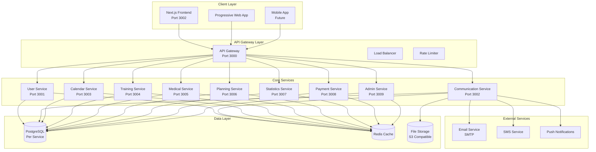
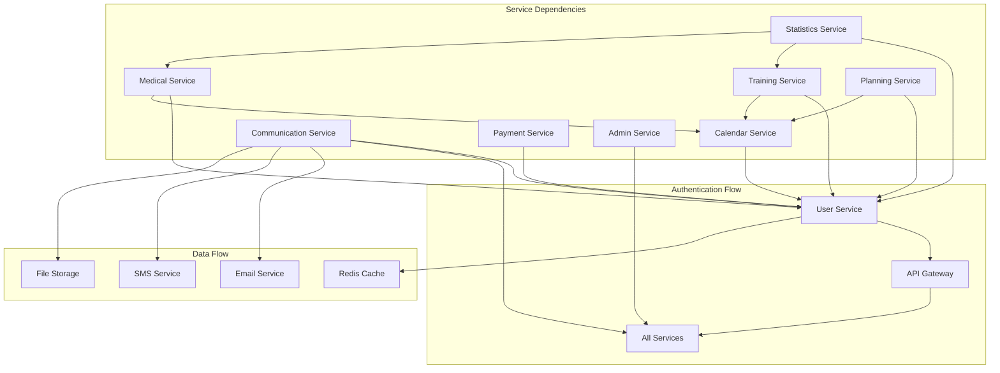
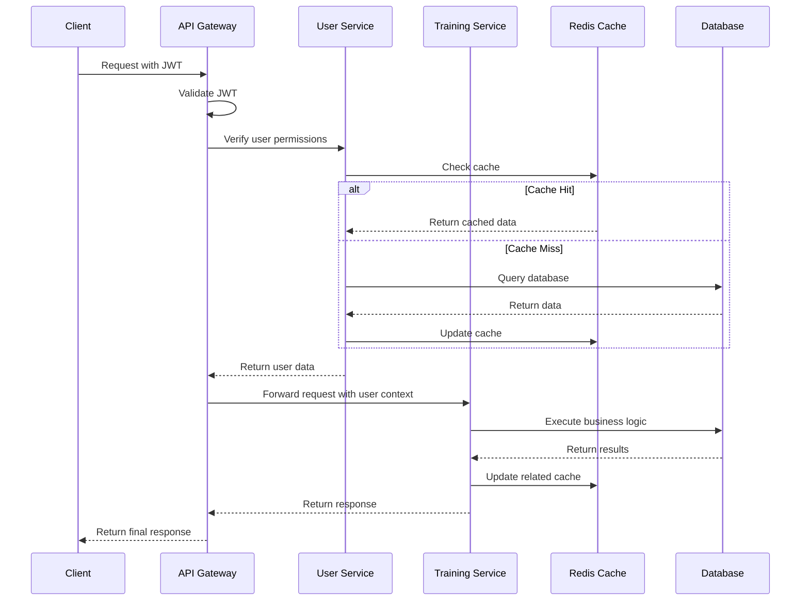
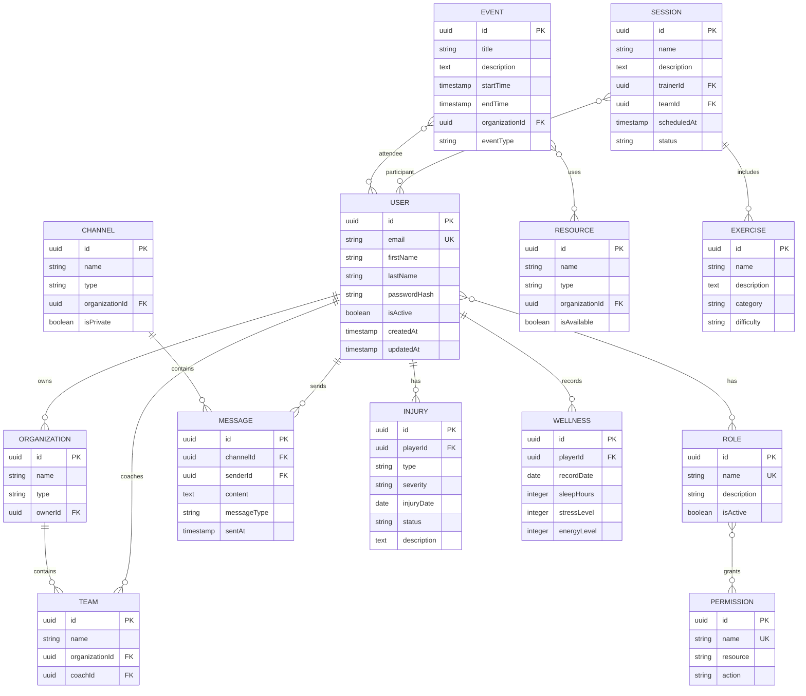
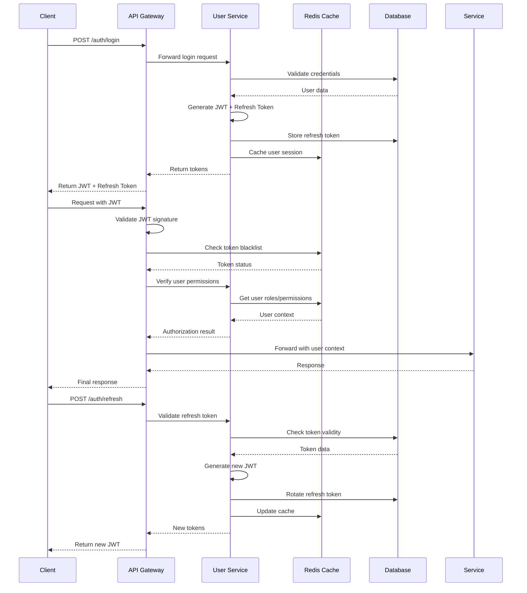
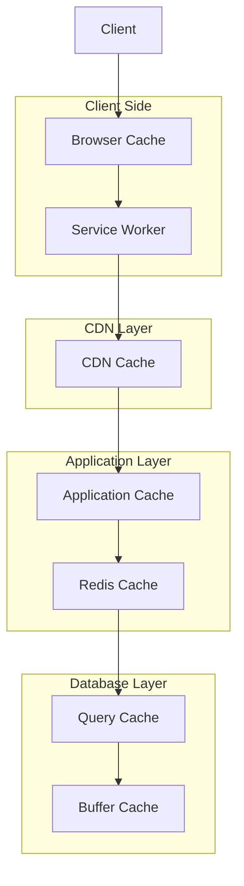

# Hockey Hub - System Architecture Documentation

## Table of Contents
1. [System Overview](#system-overview)
2. [Design Principles](#design-principles)
3. [Microservices Architecture](#microservices-architecture)
4. [Service Communication](#service-communication)
5. [Database Architecture](#database-architecture)
6. [Authentication & Authorization](#authentication--authorization)
7. [Technology Stack](#technology-stack)
8. [Performance & Scalability](#performance--scalability)
9. [Security Architecture](#security-architecture)
10. [Deployment Architecture](#deployment-architecture)

## System Overview

Hockey Hub is a comprehensive sports management platform built using a microservices architecture pattern. The system supports multiple user roles and provides real-time functionality for team management, training coordination, medical tracking, and communication.

### High-Level Architecture

## Design Principles

### 1. Microservices First
- **Single Responsibility**: Each service owns a specific business domain
- **Data Isolation**: Each service has its own database
- **Independent Deployment**: Services can be deployed independently
- **Technology Diversity**: Services can use different technologies when appropriate

### 2. API-First Design
- **Contract-Driven Development**: APIs defined before implementation
- **Versioning Strategy**: Semantic versioning with backward compatibility
- **Documentation**: OpenAPI/Swagger specifications
- **Testing**: API contracts validated through automated tests

### 3. Event-Driven Architecture
- **Asynchronous Communication**: Events for loose coupling
- **Real-time Updates**: WebSocket connections for live data
- **Audit Trail**: All state changes recorded as events
- **Resilience**: Event sourcing for system recovery

### 4. Security by Design
- **Zero Trust**: All communications authenticated and authorized
- **Defense in Depth**: Multiple security layers
- **Data Privacy**: GDPR compliance and data protection
- **Audit Logging**: Complete audit trail for compliance

### 5. Performance & Scalability
- **Caching Strategy**: Multi-layer caching (Redis, CDN, browser)
- **Database Optimization**: Proper indexing and query optimization
- **Load Balancing**: Horizontal scaling capabilities
- **Resource Efficiency**: Optimized resource usage

## Microservices Architecture

### Service Breakdown

#### Core Services

##### 1. User Service (Port 3001)
**Responsibility**: User management, authentication, and authorization
- User registration and profile management
- Role-based access control (RBAC)
- JWT token generation and validation
- Organization and team management
- Account security and lockout

**Database**: PostgreSQL (Port 5433)
**Key Entities**: User, Role, Permission, Organization, Team, RefreshToken

##### 2. Communication Service (Port 3002)
**Responsibility**: Messaging, notifications, and real-time communication
- Chat system with real-time messaging
- Email and SMS notifications
- Push notifications
- File sharing and attachments
- Chat bots and automation

**Database**: PostgreSQL (Port 5434)
**Key Entities**: Message, Channel, Notification, ChatBot, File

##### 3. Calendar Service (Port 3003)
**Responsibility**: Event scheduling and calendar management
- Event creation and management
- Resource booking (facilities, equipment)
- Recurring event patterns
- Conflict detection and resolution
- Calendar export and synchronization

**Database**: PostgreSQL (Port 5435)
**Key Entities**: Event, Participant, Resource, Recurrence, Conflict

##### 4. Training Service (Port 3004)
**Responsibility**: Training session management and tracking
- Workout session creation and execution
- Exercise library and programs
- Performance tracking
- Training analytics
- Load management

**Database**: PostgreSQL (Port 5436)
**Key Entities**: Session, Exercise, Workout, Performance, Load

##### 5. Medical Service (Port 3005)
**Responsibility**: Health tracking and medical records
- Injury tracking and management
- Medical appointments
- Wellness monitoring
- Treatment plans
- Player availability status

**Database**: PostgreSQL (Port 5437)
**Key Entities**: Injury, Treatment, Wellness, Availability, MedicalReport

#### Supporting Services

##### 6. Planning Service (Port 3006)
**Responsibility**: Long-term planning and strategy
- Season planning
- Training periodization
- Goal setting and tracking
- Resource allocation
- Strategic planning

**Database**: PostgreSQL (Port 5438)
**Key Entities**: Plan, Goal, Phase, Resource, Strategy

##### 7. Statistics Service (Port 3007)
**Responsibility**: Analytics and reporting
- Performance analytics
- Team statistics
- Reporting dashboards
- Data visualization
- Predictive analytics

**Database**: PostgreSQL (Port 5439)
**Key Entities**: Statistic, Report, Metric, Dashboard, Analysis

##### 8. Payment Service (Port 3008)
**Responsibility**: Financial transactions and billing
- Payment processing
- Subscription management
- Invoice generation
- Financial reporting
- Payment gateway integration

**Database**: PostgreSQL (Port 5440)
**Key Entities**: Payment, Invoice, Subscription, Transaction, Receipt

##### 9. Admin Service (Port 3009)
**Responsibility**: System administration and configuration
- System configuration
- User administration
- Service monitoring
- Backup management
- System health checks

**Database**: PostgreSQL (Port 5441)
**Key Entities**: Config, SystemLog, Backup, Monitor, Health

### Service Dependencies

## Service Communication

### Communication Patterns

#### 1. Synchronous Communication (HTTP/REST)
- **API Gateway Pattern**: Central entry point for all client requests
- **Service-to-Service**: Direct HTTP calls for immediate responses
- **Authentication**: JWT tokens passed through headers
- **Error Handling**: Standardized error responses

#### 2. Asynchronous Communication (Events)
- **Message Queues**: Redis pub/sub for event distribution
- **WebSocket**: Real-time communication for live updates
- **Event Sourcing**: State changes recorded as events
- **Saga Pattern**: Distributed transaction management

#### 3. Data Synchronization
- **Cache Invalidation**: Redis cache updates across services
- **Database Replication**: Read replicas for analytics
- **Event Streaming**: Real-time data synchronization
- **Batch Processing**: Scheduled data synchronization

### Service Communication Flow

### API Gateway Responsibilities

#### 1. Request Routing
- Route requests to appropriate services
- Load balancing across service instances
- Service discovery and health checking
- Timeout and retry management

#### 2. Security
- JWT token validation
- Rate limiting and DDoS protection
- CORS configuration
- Request/response logging

#### 3. Cross-Cutting Concerns
- Request correlation IDs
- Response compression
- API versioning
- Metrics collection

## Database Architecture

### Database Design Principles

#### 1. Database per Service
- **Data Ownership**: Each service owns its data
- **Technology Choice**: Different databases for different needs
- **Scaling**: Independent scaling per service
- **Failure Isolation**: Service failures don't cascade

#### 2. Data Consistency
- **ACID Properties**: Within service boundaries
- **Eventual Consistency**: Across service boundaries
- **Saga Pattern**: Distributed transactions
- **Compensation**: Rollback mechanisms

### Database Schema Overview

### Database Optimization

#### 1. Indexing Strategy
- **Primary Keys**: UUID with efficient generation
- **Foreign Keys**: Indexed for join performance
- **Query Patterns**: Indexes based on access patterns
- **Composite Indexes**: Multi-column queries

#### 2. Caching Strategy
- **Redis Cache**: Query result caching
- **Application Cache**: In-memory caching
- **CDN**: Static asset caching
- **Database Cache**: Query plan caching

#### 3. Data Archiving
- **Soft Deletes**: Logical deletion with audit trail
- **Data Retention**: Automated data lifecycle management
- **Backup Strategy**: Regular backups with point-in-time recovery
- **Compliance**: GDPR data handling and deletion

## Authentication & Authorization

### Authentication Flow

### Authorization Model

#### 1. Role-Based Access Control (RBAC)
- **Roles**: Player, Coach, Parent, Medical Staff, Equipment Manager, Physical Trainer, Club Admin, System Admin
- **Permissions**: Resource-based permissions (create, read, update, delete)
- **Hierarchical**: Role inheritance and permission delegation
- **Dynamic**: Runtime permission evaluation

#### 2. Resource-Based Authorization
- **Ownership**: Users can access their own resources
- **Team-Based**: Access based on team membership
- **Organization-Based**: Access based on organization membership
- **Time-Based**: Temporary access grants

#### 3. API Security
- **JWT Tokens**: Stateless authentication
- **Token Validation**: Signature verification and expiry checks
- **Token Blacklisting**: Revoked token tracking
- **Refresh Tokens**: Secure token renewal
- **Rate Limiting**: API abuse prevention

## Technology Stack

### Frontend Stack

#### Next.js 15.3.4
**Rationale**: 
- Server-side rendering for better SEO and performance
- API routes for backend integration
- Built-in optimization and caching
- TypeScript support out of the box
- Excellent developer experience

#### React 18
**Rationale**:
- Component-based architecture for reusability
- Virtual DOM for efficient updates
- Large ecosystem and community
- Concurrent features for better performance
- Hooks for state management

#### TypeScript 5.3.3
**Rationale**:
- Static type checking reduces runtime errors
- Better IDE support and developer experience
- Self-documenting code through types
- Refactoring safety
- Team collaboration benefits

#### UI Library (Radix UI + Tailwind CSS)
**Rationale**:
- Accessible components out of the box
- Unstyled components for customization
- Consistent design system
- Mobile-first responsive design
- Performance optimized

#### State Management (Redux Toolkit + RTK Query)
**Rationale**:
- Predictable state management
- Built-in caching and synchronization
- TypeScript integration
- DevTools for debugging
- Optimistic updates

### Backend Stack

#### Node.js + Express
**Rationale**:
- JavaScript/TypeScript consistency across stack
- High performance for I/O operations
- Large ecosystem of packages
- Easy to scale horizontally
- Good for real-time applications

#### PostgreSQL
**Rationale**:
- ACID compliance for data integrity
- Advanced query capabilities
- JSON support for flexibility
- Excellent performance
- Strong ecosystem and tooling

#### Redis
**Rationale**:
- High-performance caching
- Session storage
- Pub/sub for real-time features
- Data structure variety
- Persistence options

#### TypeORM
**Rationale**:
- TypeScript-first ORM
- Code-first or database-first approaches
- Migration management
- Repository pattern
- Active Record pattern support

### Infrastructure Stack

#### Docker
**Rationale**:
- Consistent deployment environments
- Easy scaling and orchestration
- Development environment consistency
- Microservices isolation
- CI/CD integration

#### Socket.io
**Rationale**:
- Real-time bidirectional communication
- Fallback mechanisms for older browsers
- Room-based messaging
- TypeScript support
- Scalability features

## Performance & Scalability

### Caching Strategy

#### 1. Multi-Layer Caching

#### 2. Cache Invalidation
- **Time-Based**: TTL expiration
- **Event-Based**: Cache invalidation on data changes
- **Manual**: Admin-triggered cache clearing
- **Version-Based**: Cache versioning for updates

### Database Performance

#### 1. Query Optimization
- **Index Usage**: Proper indexing for common queries
- **Query Analysis**: EXPLAIN plans and optimization
- **Connection Pooling**: Efficient database connections
- **Read Replicas**: Separate read and write operations

#### 2. Data Partitioning
- **Horizontal Partitioning**: Sharding by organization
- **Vertical Partitioning**: Separate tables by access patterns
- **Time-Based Partitioning**: Archive old data
- **Geographic Partitioning**: Data locality optimization

### Scalability Patterns

#### 1. Horizontal Scaling
- **Load Balancing**: Distribute requests across instances
- **Service Replication**: Multiple instances per service
- **Database Sharding**: Distribute data across databases
- **CDN Usage**: Global content distribution

#### 2. Vertical Scaling
- **Resource Optimization**: CPU and memory tuning
- **Database Tuning**: Configuration optimization
- **Code Optimization**: Algorithm and data structure improvements
- **Caching**: Reduce database load

## Security Architecture

### Security Layers

#### 1. Network Security
- **HTTPS Everywhere**: Encrypted communication
- **WAF (Web Application Firewall)**: Attack prevention
- **VPN Access**: Secure administrative access
- **Network Segmentation**: Isolated service networks

#### 2. Application Security
- **Input Validation**: Prevent injection attacks
- **Output Encoding**: Prevent XSS attacks
- **Authentication**: Strong user verification
- **Authorization**: Proper access control

#### 3. Data Security
- **Encryption at Rest**: Database encryption
- **Encryption in Transit**: TLS/SSL protocols
- **Key Management**: Secure key storage and rotation
- **Data Masking**: Sensitive data protection

#### 4. Infrastructure Security
- **Container Security**: Secure Docker images
- **Secret Management**: Secure credential storage
- **Monitoring**: Security event monitoring
- **Backup Security**: Secure backup storage

### Compliance

#### 1. GDPR Compliance
- **Data Minimization**: Collect only necessary data
- **Right to be Forgotten**: Data deletion capabilities
- **Data Portability**: Data export capabilities
- **Consent Management**: Explicit consent tracking

#### 2. Audit Requirements
- **Audit Logging**: Complete audit trail
- **Data Retention**: Compliance with retention policies
- **Access Logging**: User activity tracking
- **Change Tracking**: All data changes recorded

## Deployment Architecture

### Container Architecture

```mermaid
graph TB
    subgraph "Container Orchestration"
        K8S[Kubernetes Cluster]
        DOCKER[Docker Containers]
    end
    
    subgraph "Frontend Containers"
        FE_CONTAINER[Next.js Container]
        NGINX[Nginx Reverse Proxy]
    end
    
    subgraph "API Gateway Container"
        AG_CONTAINER[API Gateway Container]
    end
    
    subgraph "Service Containers"
        US_CONTAINER[User Service Container]
        CS_CONTAINER[Communication Service Container]
        CAL_CONTAINER[Calendar Service Container]
        TS_CONTAINER[Training Service Container]
        MS_CONTAINER[Medical Service Container]
        PS_CONTAINER[Planning Service Container]
        SS_CONTAINER[Statistics Service Container]
        PAY_CONTAINER[Payment Service Container]
        AS_CONTAINER[Admin Service Container]
    end
    
    subgraph "Data Containers"
        PG_CONTAINER[PostgreSQL Containers]
        REDIS_CONTAINER[Redis Container]
    end
    
    subgraph "External Services"
        S3[S3 Storage]
        EMAIL_SVC[Email Service]
        MONITORING[Monitoring Stack]
    end
    
    K8S --> DOCKER
    DOCKER --> FE_CONTAINER
    DOCKER --> AG_CONTAINER
    DOCKER --> US_CONTAINER
    DOCKER --> CS_CONTAINER
    DOCKER --> CAL_CONTAINER
    DOCKER --> TS_CONTAINER
    DOCKER --> MS_CONTAINER
    DOCKER --> PS_CONTAINER
    DOCKER --> SS_CONTAINER
    DOCKER --> PAY_CONTAINER
    DOCKER --> AS_CONTAINER
    DOCKER --> PG_CONTAINER
    DOCKER --> REDIS_CONTAINER
    
    FE_CONTAINER --> NGINX
    AG_CONTAINER --> S3
    CS_CONTAINER --> EMAIL_SVC
    ALL_CONTAINERS --> MONITORING
```

### CI/CD Pipeline

#### 1. Development Workflow
- **Feature Branches**: Isolated development
- **Pull Request Reviews**: Code quality checks
- **Automated Testing**: Unit and integration tests
- **Security Scanning**: Vulnerability detection

#### 2. Build Pipeline
- **Code Compilation**: TypeScript to JavaScript
- **Container Building**: Docker image creation
- **Security Scanning**: Container vulnerability scanning
- **Artifact Storage**: Secure artifact repository

#### 3. Deployment Pipeline
- **Environment Promotion**: Dev → Staging → Production
- **Blue-Green Deployment**: Zero-downtime deployments
- **Rollback Capabilities**: Quick rollback on issues
- **Health Monitoring**: Post-deployment health checks

### Monitoring & Observability

#### 1. Application Monitoring
- **Performance Metrics**: Response times, throughput
- **Error Tracking**: Error rates and patterns
- **User Experience**: Real user monitoring
- **Business Metrics**: Key performance indicators

#### 2. Infrastructure Monitoring
- **Resource Usage**: CPU, memory, disk, network
- **Service Health**: Health checks and uptime
- **Database Performance**: Query performance and connections
- **Cache Performance**: Hit rates and efficiency

#### 3. Logging & Tracing
- **Structured Logging**: JSON-formatted logs
- **Distributed Tracing**: Request flow across services
- **Log Aggregation**: Centralized log management
- **Alerting**: Automated alert notifications

---

This architecture documentation provides a comprehensive overview of the Hockey Hub system design. The modular, microservices-based architecture ensures scalability, maintainability, and reliability while supporting the complex requirements of a sports management platform.

For implementation details and specific service documentation, refer to the individual service README files and API documentation.