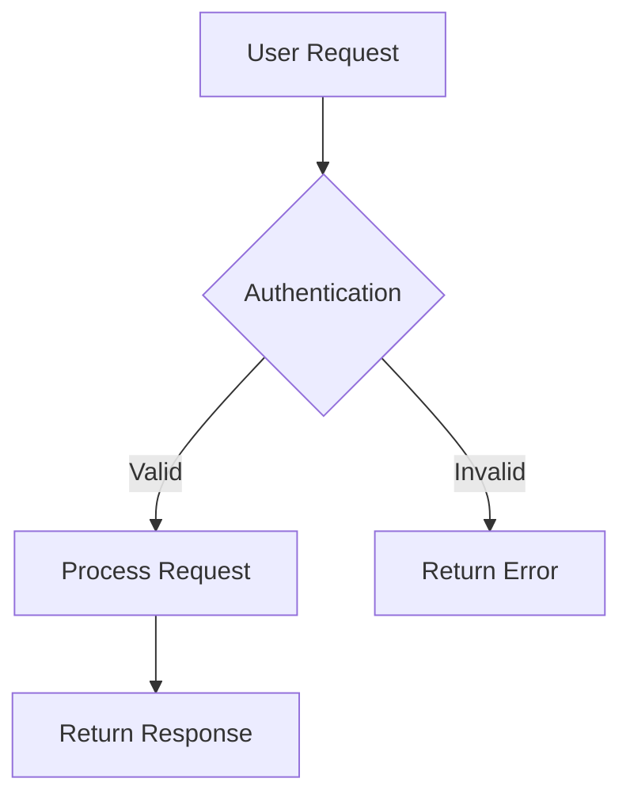

# Documentation Standards Guide

This guide establishes standards for maintaining comprehensive, consistent, and high-quality documentation across the Hockey Hub project.

## 📋 Documentation Principles

### 1. User-Centric Approach
- **Audience First**: Write for your specific audience (developers, ops, end-users)
- **Task-Oriented**: Focus on what users want to accomplish
- **Progressive Disclosure**: Start simple, provide details as needed
- **Examples First**: Lead with practical examples before theory

### 2. Consistency Standards
- **Common Structure**: Use consistent sections and formatting
- **Uniform Terminology**: Maintain consistent vocabulary
- **Cross-References**: Link related documentation appropriately
- **Version Alignment**: Keep docs synchronized with code changes

### 3. Quality Requirements
- **Accuracy**: Ensure all information is correct and current
- **Completeness**: Cover all necessary topics for the audience
- **Clarity**: Write clearly and concisely
- **Accessibility**: Make content accessible to all users

## 📝 Writing Standards

### Language & Style
- **Clear Language**: Use simple, direct language
- **Active Voice**: Prefer active over passive voice
- **Present Tense**: Use present tense for current features
- **Second Person**: Address the reader directly ("you")

### Formatting Guidelines
- **Headings**: Use descriptive, hierarchical headings
- **Lists**: Use bullet points for items, numbers for sequences
- **Code Blocks**: Always specify language for syntax highlighting
- **Links**: Use descriptive link text, not "click here"

### Example Format
```markdown
# Main Title (H1)

Brief introduction explaining the purpose and scope.

## Section Title (H2)

### Subsection (H3)

Content with clear explanations and examples.

#### Details (H4)

Specific implementation details when needed.
```

## 🏗️ Document Structure Standards

### Standard Document Template

```markdown
# [Document Title]

[Brief description of purpose and audience]

## Table of Contents (for long documents)
1. [Section 1](#section-1)
2. [Section 2](#section-2)

## Prerequisites (if applicable)
- Requirement 1
- Requirement 2

## Quick Start (if applicable)
[Minimal steps to get started]

## Main Content Sections
[Organized by logical flow]

## Examples
[Practical, working examples]

## Troubleshooting (if applicable)
[Common issues and solutions]

## Related Documentation
[Links to related docs]

---

**Last Updated**: [Date] | **Version**: [Version] | **Maintainer**: [Team/Person]
```

### Document Types & Standards

#### 1. README Files
**Purpose**: Project/component overview and quick start
**Location**: Root of each component/service
**Required Sections**:
- Project description
- Installation/setup
- Basic usage
- Links to detailed docs

#### 2. API Documentation
**Purpose**: Complete API reference
**Location**: `docs/api/`
**Required Sections**:
- Authentication
- Endpoints with examples
- Error codes
- Rate limiting
- Changelog

#### 3. User Guides
**Purpose**: End-user instructions
**Location**: `docs/guides/`
**Required Sections**:
- Getting started
- Step-by-step instructions
- Screenshots/visuals
- Troubleshooting

#### 4. Developer Guides
**Purpose**: Technical implementation details
**Location**: `docs/development/`
**Required Sections**:
- Setup instructions
- Architecture overview
- Code examples
- Testing procedures

## 🔧 Technical Standards

### Code Documentation

#### Code Comments
```typescript
/**
 * Calculates player performance score based on multiple metrics
 * @param metrics - Object containing performance data
 * @param weights - Optional weights for different metrics
 * @returns Performance score between 0-100
 * @example
 * ```typescript
 * const score = calculatePerformanceScore({
 *   goals: 10,
 *   assists: 15,
 *   saves: 200
 * });
 * ```
 */
function calculatePerformanceScore(
  metrics: PerformanceMetrics,
  weights?: MetricWeights
): number {
  // Implementation...
}
```

#### API Documentation
```markdown
### POST /api/training/sessions

Create a new training session.

**Authentication**: Required (JWT token)
**Permissions**: Coach, Physical Trainer

**Request Body**:
```json
{
  "name": "Morning Practice",
  "description": "Team practice session",
  "scheduledAt": "2025-07-15T09:00:00Z",
  "teamId": "uuid-string",
  "exercises": [...]
}
```

**Response**:
```json
{
  "id": "session-uuid",
  "name": "Morning Practice",
  "status": "scheduled",
  "createdAt": "2025-07-02T10:00:00Z"
}
```

**Error Responses**:
- `400` - Invalid request data
- `401` - Authentication required
- `403` - Insufficient permissions
- `409` - Schedule conflict
```

### File Organization

#### Directory Structure
```
docs/
├── README.md                 # Documentation index
├── guides/                   # User guides
│   ├── user/                # End-user guides
│   ├── admin/               # Administrator guides
│   └── developer/           # Developer guides
├── api/                     # API documentation
│   ├── rest/               # REST API docs
│   └── websocket/          # WebSocket docs
├── architecture/           # System design docs
├── deployment/            # Deployment guides
├── troubleshooting/       # Problem-solving guides
└── assets/               # Images, diagrams, etc.
```

#### File Naming Conventions
- Use kebab-case: `user-management-guide.md`
- Include purpose: `api-authentication.md`
- Version if needed: `deployment-guide-v2.md`
- Use descriptive names: `troubleshooting-database-connections.md`

## 🖼️ Visual Standards

### Screenshots & Images
- **Format**: PNG for screenshots, SVG for diagrams
- **Size**: Optimize for web (compress large images)
- **Alt Text**: Always include descriptive alt text
- **Captions**: Add captions explaining the image
- **Consistency**: Use consistent UI theme/version

### Diagrams & Charts
- **Tools**: Mermaid for code-based diagrams, Lucidchart for complex ones
- **Style**: Consistent colors and styling
- **Labels**: Clear, readable labels
- **Context**: Include diagram context and purpose

#### Mermaid Diagram Example


## 📊 Quality Assurance

### Review Process

#### Documentation Reviews
1. **Technical Accuracy**: Verify all technical details
2. **Completeness**: Ensure all necessary topics covered
3. **Clarity**: Check for clear, understandable language
4. **Consistency**: Verify adherence to standards
5. **Links**: Test all internal and external links

#### Review Checklist
- [ ] Content is accurate and current
- [ ] Structure follows standard template
- [ ] Code examples work correctly
- [ ] Links are functional
- [ ] Screenshots are current
- [ ] Grammar and spelling checked
- [ ] Audience-appropriate language used

### Maintenance Process

#### Regular Updates
- **Code Changes**: Update docs with code changes
- **Feature Releases**: Document new features
- **API Changes**: Update API documentation
- **Quarterly Reviews**: Review all documentation quarterly

#### Version Control
- **Git History**: Maintain documentation in version control
- **Change Logs**: Document significant changes
- **Branch Strategy**: Use same branching as code
- **Pull Requests**: Review documentation changes

## 🛠️ Tools & Automation

### Recommended Tools

#### Writing & Editing
- **Editor**: VS Code with Markdown extensions
- **Grammar**: Grammarly or similar
- **Spell Check**: Built-in spell checkers
- **Preview**: Markdown preview in editor

#### Diagrams & Visuals
- **Mermaid**: Code-based diagrams
- **Lucidchart**: Complex system diagrams
- **Figma**: UI mockups and designs
- **Snagit/Screenshot tools**: Consistent screenshots

#### Validation & Testing
- **Markdown Lint**: Automated formatting checks
- **Link Checkers**: Verify link functionality
- **Spell Check**: Automated spell checking
- **Grammar Check**: Automated grammar validation

### Automation Opportunities

#### CI/CD Integration
```yaml
# Example GitHub Action for doc validation
name: Documentation Validation
on: [pull_request]
jobs:
  validate-docs:
    runs-on: ubuntu-latest
    steps:
      - uses: actions/checkout@v2
      - name: Lint Markdown
        uses: DavidAnson/markdownlint-cli2-action@v8
      - name: Check Links
        uses: lycheeverse/lychee-action@v1
```

#### Automated Updates
- **API Docs**: Generate from OpenAPI specs
- **Code Examples**: Extract from tested code
- **Screenshots**: Automated UI testing screenshots
- **Metrics**: Auto-update project statistics

## 📋 Documentation Audit Checklist

### Monthly Audit
- [ ] All documentation links functional
- [ ] Screenshots current with latest UI
- [ ] Code examples work with current version
- [ ] New features documented
- [ ] Deprecated features marked/removed

### Quarterly Review
- [ ] Complete documentation structure review
- [ ] User feedback incorporated
- [ ] Analytics reviewed (if available)
- [ ] Style guide compliance
- [ ] Cross-team documentation consistency

### Annual Assessment
- [ ] Complete documentation strategy review
- [ ] Tool evaluation and updates
- [ ] Process improvement recommendations
- [ ] Training needs assessment
- [ ] Documentation goals for next year

## 🎯 Success Metrics

### Quality Metrics
- **Accuracy**: Error reports per document
- **Completeness**: Coverage of all features
- **Usability**: User success rate with docs
- **Maintenance**: Time between updates

### Usage Metrics
- **Page Views**: Most/least accessed docs
- **User Paths**: How users navigate docs
- **Search Terms**: What users look for
- **Feedback**: User satisfaction scores

### Team Metrics
- **Contribution**: Who contributes to docs
- **Review Time**: How long reviews take
- **Update Frequency**: How often docs are updated
- **Compliance**: Adherence to standards

---

## 📞 Support & Resources

### Getting Help
- **Style Questions**: Ask the documentation team
- **Technical Issues**: File GitHub issues
- **Tool Problems**: Check internal support channels
- **Process Questions**: Review this guide or ask team leads

### Resources
- **Markdown Guide**: [markdownguide.org](https://www.markdownguide.org/)
- **Mermaid Docs**: [mermaid-js.github.io](https://mermaid-js.github.io/)
- **Writing Guide**: [Google Developer Style Guide](https://developers.google.com/style)
- **Accessibility**: [Web Content Accessibility Guidelines](https://www.w3.org/WAI/WCAG21/quickref/)

---

**Document Information**
- **Last Updated**: July 2, 2025
- **Version**: 1.0.0
- **Maintainer**: Hockey Hub Documentation Team
- **Review Schedule**: Quarterly
- **Next Review**: October 2, 2025

*This guide is a living document that should evolve with our project and team needs.*