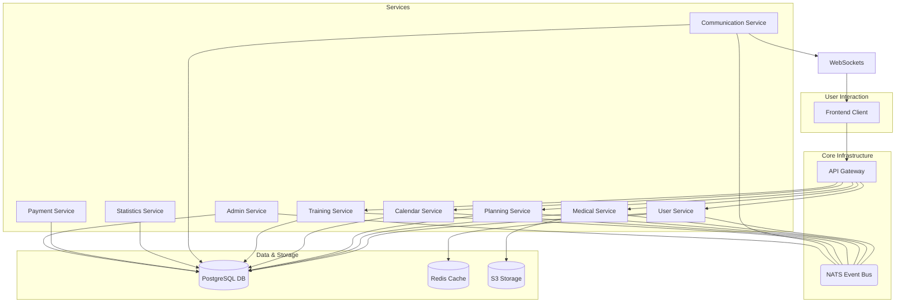
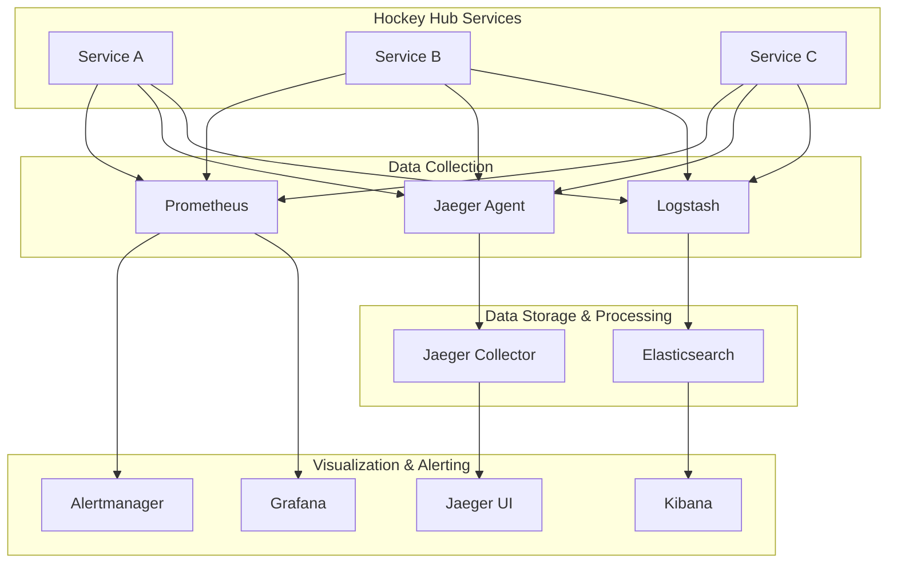
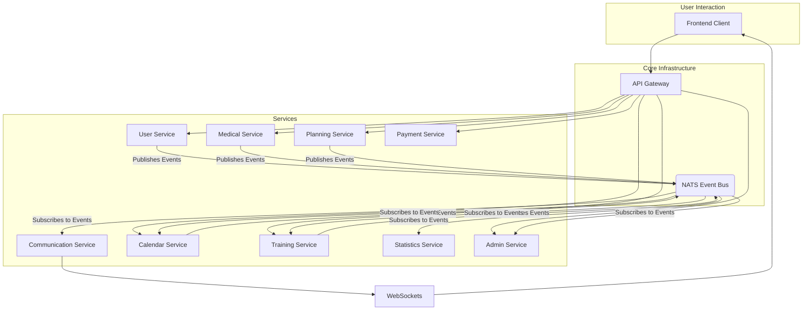

# Hockey Hub - System Patterns

## System Architecture

The Hockey Hub is built on a microservice architecture with clearly defined service boundaries. Each service focuses on a specific domain, maintaining separation of concerns while enabling efficient, event-driven communication between components.

### Architecture Overview

### Observability & Monitoring Stack
A comprehensive monitoring and observability solution has been implemented to ensure system health, performance, and reliability. [[memory:6384293909347582517]]

### Service Boundaries

1.  **API Gateway (Port 3000)**
    *   Entry point for all client requests
    *   Request routing to appropriate services
    *   Authentication and authorization (JWT validation)
    *   Rate limiting and request validation
    *   Server-Side Request Forgery (SSRF) protection. [[memory:1408181784522788330]]

2.  **User Service (Port 3001)**
   - User management and authentication
   - Role-based permissions
   - Team management
   - Parent-child relationships
   - CSV user import
   - Manages user-related data, including JWT generation. [[memory:4045275568113935009]]

3. **Communication Service (Port 3002)**
   - Real-time messaging (WebSockets)
   - Group and private chats
   - Notifications
   - Message attachments and image sharing
   - Read receipts
   - Connects to NATS to consume events for notifications.

4. **Calendar Service (Port 3003)**
   - Event management and scheduling
   - Resource booking and availability
   - Calendar views and filtering
   - Conflict detection
   - Location management

5. **Training Service (Port 3004)**
   - Training plan management
   - Exercise library with categories and predefined exercises. [[memory:5926281153998843226]]
   - Physical testing
   - Session templates
   - Real-time session tracking via WebSockets.

6. **Medical Service (Port 3005)**
   - Injury tracking with detailed timelines, treatments, and updates. [[memory:8575056704038898426]]
   - Treatment planning and exercise integration. [[memory:5926281153998843226]]
   - Rehabilitation management
   - Player availability status
   - Medical document upload (S3 integration). [[memory:6640872325499110337]]
   - Backend is fully integrated and operational. [[memory:4774941026916976904]]

7. **Planning Service (Port 3006)**
   - Season planning
   - Goal setting (team/individual)
   - Development Plans.
   - Backend is ~90% complete but has critical runtime errors (500 Internal Server Error) preventing integration. [[memory:248097510482242080]]

8. **Statistics Service (Port 3007)**
   - Performance tracking
   - Data visualization
   - External data integration
   - Reporting
   - Trend analysis
   - Currently a skeleton service with minimal implementation. [[memory:7952211796137778636]]

9. **Payment Service (Port 3008)**
   - Subscription management
   - Payment processing
   - Invoice generation
   - Payment provider integration
   - Partially implemented, no Stripe integration yet. [[memory:7952211796137778636]]

10. **Admin Service (Port 3009)**
    - System monitoring
    - Organization onboarding
    - System configuration
    - Usage statistics
    - Tenant management

## Key Design Patterns

### Gateway Pattern
- API Gateway as single entry point for all client requests
- Handles cross-cutting concerns like authentication
- Routes requests to appropriate microservices
- Implements API composition when needed

### Saga Pattern
- Used for managing distributed transactions that span multiple services to ensure data consistency without two-phase commits.
- A key example is the `PlayerTransferSaga` which coordinates actions across User, Team, and potentially other services when a player moves between teams.
- Follows Rule 1.4 for implementing distributed transactions.

### Circuit Breaker Pattern
- Implemented to prevent cascading failures when a service is down or experiencing high latency.
- It monitors for failures and, after a certain threshold, "opens" the circuit to stop sending requests to the failing service, returning an error immediately.
- This is a core component of the monitoring package and helps maintain system resilience, following Rule 1.5. [[memory:6384293909347582517]]

### Repository Pattern
- Each service implements repositories for data access
- Abstracts database operations from business logic
- Enables potential data source changes with minimal impact
- Standardized query and persistence methods

### CQRS (Command Query Responsibility Segregation)
- Separate models for read and write operations
- Optimized queries for reporting and analytics
- Event sourcing for certain critical domains
- Performance optimization for read-heavy operations

### Event-Driven Communication
- Services publish events to a central event bus when their state changes, reducing tight coupling.
- **NATS** is used as the high-performance messaging system for the event bus. [[memory:4045275568113935009]]
- Other services subscribe to relevant topics on NATS to receive events and react accordingly (e.g., updating their own data, sending notifications).
- This enables eventual consistency and a more resilient, scalable architecture.

### Observer Pattern
- Used for real-time notifications to the frontend.
- WebSocket implementation for instant updates
- Notification fanout to relevant users
- Status changes propagate to interested parties

### Factory Pattern
- Creation of complex objects like training plans
- AI-generated content creation
- Templated content generation
- Standardized object initialization

### Strategy Pattern
- Dynamic algorithm selection based on context
- Different statistical analysis approaches
- Various notification delivery methods
- Flexible rendering for multiple device types

### Decorator Pattern
- Adding capabilities to objects at runtime
- Permission checking for resources
- Logging and monitoring
- Caching frequently accessed data

## Component Relationships

Services are designed to be as decoupled as possible, primarily communicating through the API Gateway for synchronous requests and NATS for asynchronous events.

## Planned Data Flow Patterns

### Authentication Flow
1. Client sends credentials to the API Gateway (`/api/v1/auth/login`).
2. Gateway forwards the request to the User Service.
3. User Service validates credentials against the database and, if successful, generates a JWT access token and a refresh token.
4. The JWT tokens are returned to the client. The frontend stores them securely (e.g., access token in memory, refresh token in HttpOnly cookie).
5. The client includes the access token in the `Authorization` header for all subsequent requests to protected endpoints.
6. The API Gateway has middleware that validates the JWT token on incoming requests before routing them to the appropriate downstream service.
7. The JWT contains user roles and permissions (`organizationId`, `teamIds`), which services use for authorization. [[memory:4774941026916976904]]
8. This flow is fully implemented and operational. [[memory:8507756843175672381]]

### Real-Time Communication Flow
1. Client establishes a WebSocket connection through the gateway to the Communication Service.
2. Messages sent via WebSocket to Communication Service
3. Communication Service persists messages and determines recipients
4. Service pushes messages to connected recipients via WebSockets
5. Offline users receive notifications when they reconnect
6. Read receipts track message status

### Calendar Event Creation Flow
1. User creates event through frontend
2. Request routed to Calendar Service via API Gateway
3. Calendar Service validates event details and checks conflicts
4. Event stored in database if valid
5. Service publishes event creation notification
6. Communication Service notifies relevant users
7. Event appears in users' calendars

### Training Plan Implementation Flow
1. Coach creates training plan in Training Service
2. Training Service resolves personalized values based on player data
3. Plan scheduled through Calendar Service
4. Players notified via Communication Service
5. Players execute training and record results
6. Results analyzed by Statistics Service
7. Progress visualized to coach and players

## Technical Decisions

### API Design
- RESTful API design for most service-to-service communication
- GraphQL for data-intensive frontend queries
- WebSockets for real-time features
- Consistent HTTP status codes and error formats
- API versioning strategy for backward compatibility

### Authentication Strategy
- JWT-based authentication with short-lived access tokens (15 minutes)
- Refresh tokens with longer lifespan (7 days)
- Token storage in memory (access token) and secure HttpOnly cookies (refresh token).
- Role and permission claims (`organizationId`, `teamIds`, `lang`) embedded in tokens. [[memory:3.6]] [[memory:4774941026916976904]]
- Support for session revocation

### Error Handling
- A standardized error response structure is used across all microservices. [[memory:6.1]]
- Structured, centralized logging via the ELK stack allows for robust error tracking and analysis. [[memory:6384293909347582517]]
- Correlation IDs are used to trace requests as they travel through multiple services.
- **Circuit Breakers** (using `opossum`) are implemented in the monitoring package to prevent cascading failures. [[memory:6384293909347582517]]
- Retry policies with exponential backoff for transient failures in service-to-service communication.

### Internationalization Architecture
- Centralized translation management using `i18next`.
- Language preference stored in user profile
- Translation keys using dot notation
- Frontend internationalization with `react-i18next`.
- Support for language-specific formatting of dates, numbers, and currencies.
- User's language preference is included in the JWT token for use across services. [[memory:3.6]]

### Data Consistency
- A hybrid approach is used. ACID transactions are enforced within individual service boundaries.
- For distributed transactions spanning multiple services, the **Saga Pattern** is implemented to ensure eventual consistency.
- **NATS Event Bus** is the backbone for asynchronous communication to propagate state changes.
- Optimistic UI updates are used in the frontend to provide a responsive user experience, with background synchronization handling potential conflicts.
- Clear data ownership is defined for each service.

### Caching Strategy
- A multi-level caching strategy is employed.
- **Redis** is used for distributed caching of frequently accessed data, such as user sessions or configuration.
- In-memory caching is used within services for hot data.
- The `shared-lib` provides a `CacheManager` with decorators for easy implementation of caching logic.
- Cache invalidation is triggered by events published on the NATS bus.

### Security Model
- Role-Based Access Control (RBAC) is the primary authorization mechanism.
- Attribute-Based Access Control (ABAC) is used for more fine-grained permissions where needed.
- All sensitive data is encrypted at rest and in transit.
- Comprehensive input validation is performed at the API Gateway and service level.
- **Server-Side Request Forgery (SSRF)** is mitigated in the API Gateway.
- Path traversal vulnerabilities have been addressed.
- **Cryptographically secure random number generation** is used instead of `Math.random()`.
- These measures were part of a major security hardening effort. [[memory:1408181784522788330]]

This document outlines the implemented system architecture, key design patterns, component relationships, data flows, and technical decisions that form the foundation of the Hockey Hub.