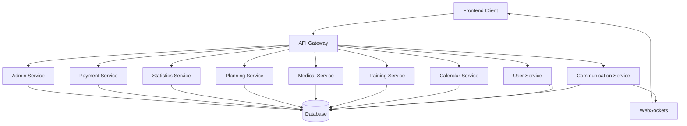

# Hockey Hub - System Patterns

## System Architecture

The Hockey Hub will be built on a microservice architecture with clearly defined service boundaries. Each service will focus on a specific domain, maintaining separation of concerns while enabling efficient communication between components.

### Architecture Overview



### Service Boundaries

1. **API Gateway (Port 3000)**
   - Entry point for all client requests
   - Request routing to appropriate services
   - Authentication and authorization
   - Rate limiting and request validation

2. **User Service (Port 3001)**
   - User management and authentication
   - Role-based permissions
   - Team management
   - Parent-child relationships
   - CSV user import

3. **Communication Service (Port 3002)**
   - Real-time messaging (WebSockets)
   - Group and private chats
   - Notifications
   - Message attachments and image sharing
   - Read receipts

4. **Calendar Service (Port 3003)**
   - Event management and scheduling
   - Resource booking and availability
   - Calendar views and filtering
   - Conflict detection
   - Location management

5. **Training Service (Port 3004)**
   - Training plan management
   - Exercise library
   - Physical testing
   - Session templates
   - Training intensity calculation

6. **Medical Service (Port 3005)**
   - Injury tracking
   - Treatment planning
   - Rehabilitation management
   - Player availability status
   - Medical journal

7. **Planning Service (Port 3006)**
   - Season planning
   - Goal setting (team/individual)
   - Periodization
   - Training cycles
   - Resource allocation

8. **Statistics Service (Port 3007)**
   - Performance tracking
   - Data visualization
   - External data integration
   - Reporting
   - Trend analysis

9. **Payment Service (Port 3008)**
   - Subscription management
   - Payment processing
   - Invoice generation
   - Payment provider integration

10. **Admin Service (Port 3009)**
    - System monitoring
    - Organization onboarding
    - System configuration
    - Usage statistics
    - Tenant management

## Key Design Patterns

### Gateway Pattern
- API Gateway as single entry point for all client requests
- Handles cross-cutting concerns like authentication
- Routes requests to appropriate microservices
- Implements API composition when needed

### Repository Pattern
- Each service implements repositories for data access
- Abstracts database operations from business logic
- Enables potential data source changes with minimal impact
- Standardized query and persistence methods

### CQRS (Command Query Responsibility Segregation)
- Separate models for read and write operations
- Optimized queries for reporting and analytics
- Event sourcing for certain critical domains
- Performance optimization for read-heavy operations

### Event-Driven Communication
- Services publish events when state changes
- Other services subscribe to relevant events
- Reduces tight coupling between services
- Enables eventual consistency

### Observer Pattern
- Used for real-time notifications
- WebSocket implementation for instant updates
- Notification fanout to relevant users
- Status changes propagate to interested parties

### Factory Pattern
- Creation of complex objects like training plans
- AI-generated content creation
- Templated content generation
- Standardized object initialization

### Strategy Pattern
- Dynamic algorithm selection based on context
- Different statistical analysis approaches
- Various notification delivery methods
- Flexible rendering for multiple device types

### Decorator Pattern
- Adding capabilities to objects at runtime
- Permission checking for resources
- Logging and monitoring
- Caching frequently accessed data

## Component Relationships

### Service Dependencies
```
api-gateway
├── depends on all services for routing

user-service
├── independent (core service)

communication-service
├── depends on user-service for user data
├── produces notifications consumed by other services

calendar-service
├── depends on user-service for team information
├── integrates with communication-service for notifications
├── depends on resource availability information

training-service
├── depends on user-service for player data
├── depends on calendar-service for scheduling
├── integrates with medical-service for player status
├── depends on statistics-service for test results

medical-service
├── depends on user-service for player data
├── integrates with communication-service for notifications
├── provides player status to other services
├── depends on training-service for exercise recommendations

planning-service
├── depends on user-service for team data
├── depends on calendar-service for availability
├── integrates with training-service for plan execution
├── depends on statistics-service for performance data

statistics-service
├── depends on user-service for player/team data
├── aggregates data from training-service
├── collects data from medical-service
├── may integrate with external data sources

payment-service
├── depends on user-service for user data
├── integrates with admin-service for subscription management

admin-service
├── depends on all services for monitoring
├── has system-wide configuration responsibilities
```

## Planned Data Flow Patterns

### Authentication Flow
1. Client sends credentials to API Gateway
2. Gateway forwards to User Service
3. User Service validates and generates JWT tokens (access + refresh)
4. JWT tokens returned to client via Gateway
5. Client includes access token in all subsequent requests
6. Gateway validates token before routing requests
7. Refresh flow handles token expiration

### Real-Time Communication Flow
1. Client establishes WebSocket connection through gateway
2. Messages sent via WebSocket to Communication Service
3. Communication Service persists messages and determines recipients
4. Service pushes messages to connected recipients via WebSockets
5. Offline users receive notifications when they reconnect
6. Read receipts track message status

### Calendar Event Creation Flow
1. User creates event through frontend
2. Request routed to Calendar Service via API Gateway
3. Calendar Service validates event details and checks conflicts
4. Event stored in database if valid
5. Service publishes event creation notification
6. Communication Service notifies relevant users
7. Event appears in users' calendars

### Training Plan Implementation Flow
1. Coach creates training plan in Training Service
2. Training Service resolves personalized values based on player data
3. Plan scheduled through Calendar Service
4. Players notified via Communication Service
5. Players execute training and record results
6. Results analyzed by Statistics Service
7. Progress visualized to coach and players

## Technical Decisions

### API Design
- RESTful API design for most service-to-service communication
- GraphQL for data-intensive frontend queries
- WebSockets for real-time features
- Consistent HTTP status codes and error formats
- API versioning strategy for backward compatibility

### Authentication Strategy
- JWT-based authentication with short-lived access tokens (15 minutes)
- Refresh tokens with longer lifespan (7 days)
- Token storage in HttpOnly cookies for security
- Role and permission claims embedded in tokens
- Support for session revocation

### Error Handling
- Standardized error response format across all services
- Detailed logging with correlation IDs
- Graceful degradation when services are unavailable
- Circuit breakers to prevent cascading failures
- Retry policies for transient failures

### Internationalization Architecture
- Centralized translation service
- Language preference stored in user profile
- Translation keys using dot notation
- Frontend internationalization with i18next
- Support for language-specific formatting of dates, numbers, etc.

### Data Consistency
- Eventual consistency between services
- Event-driven updates for cross-service data
- Optimistic UI updates with background synchronization
- Versioned data to detect conflicts
- Clear ownership of data by specific services

### Caching Strategy
- Multi-level caching strategy
- Browser-level caching for static assets
- Memory caching for frequent requests
- Distributed caching for shared data
- Cache invalidation based on events

### Security Model
- Role-based access control (RBAC)
- Attribute-based access for fine-grained permissions
- Data encryption for sensitive information
- Input validation on all endpoints
- Regular security audits and penetration testing

This document outlines the planned system architecture, key design patterns, component relationships, data flows, and technical decisions that will form the foundation of the Hockey Hub.